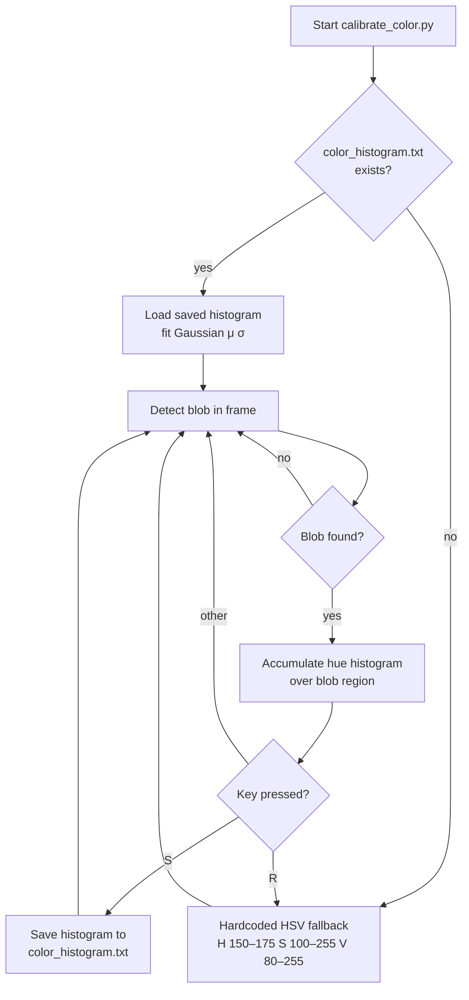
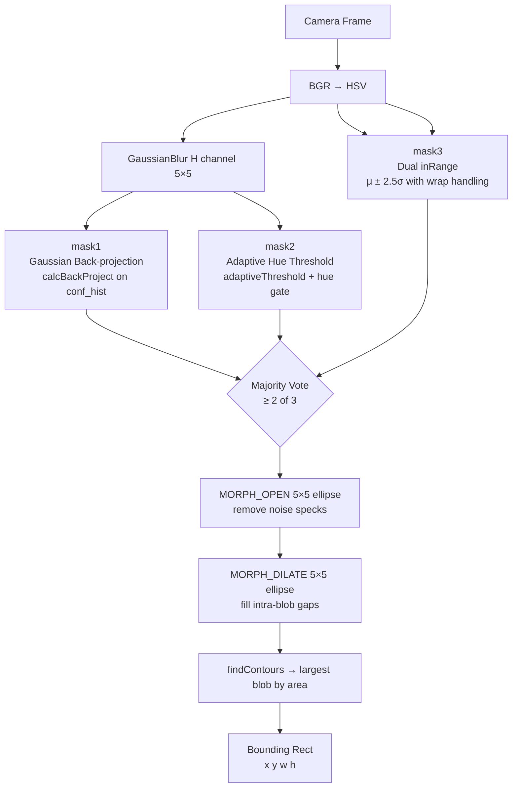

# Color Detection

## Overview

The drone-seeker system detects a hot-pink target using a multi-stage computer vision pipeline in `seeker.py`. Detection is calibration-driven: a hue histogram saved by `calibrate_color.py` defines the target color model. Without a calibration file the system falls back to hardcoded hot-pink HSV ranges.

---

## 1. Calibration (`calibrate_color.py`)

Before flight, run `calibrate_color.py` to build a color model for the specific target under actual lighting conditions.

### Workflow

1. Point the camera at the hot-pink target.
2. The tool detects blobs using either the saved confidence histogram or the hardcoded HSV fallback.
3. A 180-bin hue histogram is accumulated over the detected blob region.
4. Press **S** to save the raw normalised histogram to `color_histogram.txt`.
5. Press **R** to reset to the HSV fallback.



### Saved file format

Plain ASCII, 180 lines — one normalised floating-point weight per hue bin (OpenCV hue 0–179).

---

## 2. Color Model Fitting (`seeker.py`)

At startup, `Seeker` loads the calibration histogram and fits a statistical model to it.

### 2.1 Circular Gaussian fit (`_fit_gaussian`)

Hot pink straddles the 0/179 hue boundary, so a standard arithmetic mean is meaningless. Instead:

1. Convert each bin index to an angle on the unit circle:
   `θ_i = i × 2π / 180`
2. Compute the weighted unit-vector sum over all 180 bins:
   `(cx, cy) = Σ p_i (cos θ_i, sin θ_i)`
3. Circular mean: `μ = atan2(cy, cx)` mapped back to [0, 179].
4. Circular standard deviation: wrap bin distances to [−90, 90] relative to μ, then compute the weighted variance → `σ`.

```python
def _fit_gaussian(hist: np.ndarray) -> tuple[float, float]:
    bins = np.arange(180, dtype=np.float32)
    h    = hist.flatten().astype(np.float32)
    total = h.sum()
    if total == 0:
        return 90.0, 30.0

    prob = h / total

    # Circular mean via unit-vector averaging
    angles = bins * (2.0 * np.pi / 180.0)
    cx = float(np.sum(np.cos(angles) * prob))
    cy = float(np.sum(np.sin(angles) * prob))
    mean_rad = np.arctan2(cy, cx)
    if mean_rad < 0:
        mean_rad += 2.0 * np.pi
    mean_hue = float(mean_rad * 180.0 / (2.0 * np.pi))

    # Circular std: wrap bins to [-90, 90] relative to mean, then compute variance
    diff = bins - mean_hue
    diff = ((diff + 90.0) % 180.0) - 90.0   # wrap to [-90, 90]
    var  = float(np.sum(diff ** 2 * prob))
    return mean_hue, float(np.sqrt(max(var, 1.0)))
```

### 2.2 Confidence histogram (`_confidence_hist`)

Zero every bin whose circular distance from μ exceeds **2.5 σ**:

```python
def _confidence_hist(hist: np.ndarray, mean: float, std: float) -> np.ndarray:
    bins = np.arange(180, dtype=np.float32)
    diff = np.abs(bins - mean)
    diff = np.minimum(diff, 180.0 - diff)          # circular wrap
    conf = hist.flatten().copy().astype(np.float32)
    conf[diff >= _GAUSS_SIGMA * std] = 0.0
    return conf.reshape(hist.shape)
```

Only hue values genuinely belonging to the target (within 2.5 standard deviations) contribute to detection. This histogram is used for all downstream back-projection.

---

## 3. Detection Pipeline (`_detection_mask`)

Each frame runs the following steps:

### Step 1 — Hue blur

A 5×5 Gaussian blur on the H channel suppresses per-pixel hue noise from JPEG artefacts, demosaicing, and specular highlights:

```python
h_blur = cv2.GaussianBlur(hsv[:, :, 0], (5, 5), 0)
```

### Step 2 — Three independent masks

Three methods each produce a binary mask independently. A pixel is **accepted when at least 2 of 3 methods agree** (majority vote).

#### Method 1 — Gaussian back-projection (`_mask_gaussian`)

Back-projects the confidence histogram onto the blurred hue channel. Bins closer to μ carry higher weights, so the confidence histogram encodes the full learned distribution, not just a gate:

```python
def _mask_gaussian(self, hsv: np.ndarray, h_blur: np.ndarray) -> np.ndarray:
    hsv_blur = hsv.copy()
    hsv_blur[:, :, 0] = h_blur
    bp     = cv2.calcBackProject([hsv_blur], [0], self._conf_hist, [0, 180], 1)
    in_sat = (hsv[:, :, 1] >= 100) & (hsv[:, :, 1] <= 255)
    in_val =  hsv[:, :, 2] >= 80
    return ((bp > 0) & in_sat & in_val).astype(np.uint8) * 255
```

- **S ≥ 100**: rejects pastel / pale pinks — hot pink is a vivid, saturated colour.
- **V ≥ 80**: rejects dark pixels.

#### Method 2 — Adaptive hue threshold (`_mask_adaptive`)

Finds pixels whose hue is locally consistent, handling uneven illumination across the frame:

1. Normalise `h_blur` to 0–255.
2. Apply `adaptiveThreshold` (blockSize=21, C=3) — each pixel is compared to the Gaussian-weighted mean of its 21×21 neighbourhood.
3. Gate with a circular hue-distance fence: `|circular_distance(H, μ)| < 2.5 σ`.

```python
def _mask_adaptive(self, hsv: np.ndarray, h_blur: np.ndarray) -> np.ndarray:
    h_norm   = cv2.normalize(h_blur, None, 0, 255, cv2.NORM_MINMAX)
    adapt    = cv2.adaptiveThreshold(
        h_norm, 255,
        cv2.ADAPTIVE_THRESH_GAUSSIAN_C,
        cv2.THRESH_BINARY,
        blockSize=21, C=3,
    )
    diff     = np.abs(h_blur.astype(np.float32) - self._gauss_mean)
    diff     = np.minimum(diff, 180.0 - diff)            # circular wrap
    hue_gate = (diff < _GAUSS_SIGMA * self._gauss_std).astype(np.uint8) * 255
    return cv2.bitwise_and(adapt, hue_gate)
```

Robust to scenes where one side of the target is brighter than the other.

#### Method 3 — Dual inRange (`_mask_inrange`)

Builds one or two `cv2.inRange` HSV bands from `[μ − 2.5σ,  μ + 2.5σ]`. When the range crosses the 0/180 hue wrap boundary it is split automatically:

```python
def _mask_inrange(self, hsv: np.ndarray) -> np.ndarray:
    lo_h = self._gauss_mean - _GAUSS_SIGMA * self._gauss_std
    hi_h = self._gauss_mean + _GAUSS_SIGMA * self._gauss_std

    mask = np.zeros(hsv.shape[:2], dtype=np.uint8)

    def _add_range(a, b):
        a, b = max(0, int(a)), min(179, int(b))
        if a <= b:
            mask |= cv2.inRange(hsv,
                                np.array([a, 100,  80]),
                                np.array([b, 255, 255]))

    if lo_h < 0:
        _add_range(lo_h + 180, 179)
        _add_range(0, hi_h)
    elif hi_h > 179:
        _add_range(lo_h, 179)
        _add_range(0, hi_h - 180)
    else:
        _add_range(lo_h, hi_h)

    return mask
```

Primary safeguard for wraparound colours such as hot pink and magenta.

### Step 3 — Majority vote

```python
votes = ((m1 > 0).astype(np.uint8) +
         (m2 > 0).astype(np.uint8) +
         (m3 > 0).astype(np.uint8))
mask  = (votes >= 2).astype(np.uint8) * 255
```

### Step 4 — Morphological cleanup

```python
kernel = cv2.getStructuringElement(cv2.MORPH_ELLIPSE, (5, 5))
mask = cv2.morphologyEx(mask, cv2.MORPH_OPEN,   kernel)  # remove isolated noise specks
mask = cv2.morphologyEx(mask, cv2.MORPH_DILATE, kernel)  # fill gaps within the blob
```

### Fallback (no calibration file)

If no histogram file is found, detection uses a single hardcoded hot-pink band:

| H | S | V | Description |
|---|---|---|---|
| 150–175 | 100–255 | 80–255 | Hot pink / magenta |

---

## 4. Blob Selection (`_nearest_blob_rect`)

`cv2.findContours` extracts all external contours from the mask. The **largest contour by area** is selected provided it meets the minimum threshold:

```python
_MIN_BLOB_AREA = 50  # px²

def _nearest_blob_rect(mask: np.ndarray, frame_shape=None):
    contours, _ = cv2.findContours(mask, cv2.RETR_EXTERNAL, cv2.CHAIN_APPROX_SIMPLE)
    if not contours:
        return None
    valid = [(c, cv2.contourArea(c)) for c in contours if cv2.contourArea(c) >= _MIN_BLOB_AREA]
    if not valid:
        return None
    best, _ = max(valid, key=lambda item: item[1])
    return cv2.boundingRect(best)
```

Returns the axis-aligned bounding rectangle `(x, y, w, h)`, or `None` if no valid blob is found.

---

## Summary Diagram


