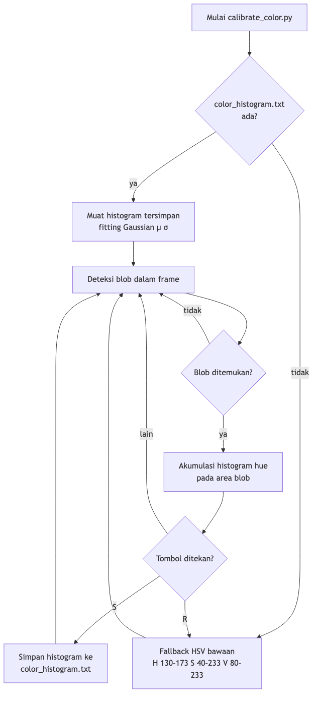

# Deteksi Warna

## Gambaran Umum

Sistem drone-seeker mendeteksi target berwarna merah-muda terang (hot-pink) menggunakan pipeline computer vision bertingkat di `seeker.py`. Deteksi berbasis kalibrasi: histogram hue yang disimpan oleh `calibrate_color.py` mendefinisikan model warna target. Tanpa file kalibrasi, sistem menggunakan rentang HSV hot-pink yang dikodekan langsung sebagai fallback.

---

## 1. Kalibrasi (`calibrate_color.py`)

Sebelum terbang, jalankan `calibrate_color.py` untuk membangun model warna target sesuai kondisi pencahayaan nyata.

### Alur Kerja

1. Arahkan kamera ke target hot-pink.
2. Alat mendeteksi blob menggunakan histogram kepercayaan yang tersimpan atau fallback HSV yang dikodekan.
3. Histogram hue 180-bin diakumulasi dari region blob yang terdeteksi.
4. Tekan **S** untuk menyimpan histogram yang telah dinormalisasi ke `color_histogram.txt`.
5. Tekan **R** untuk mereset ke fallback HSV.



### Format file yang disimpan

ASCII biasa, 180 baris — satu bobot floating-point yang dinormalisasi per bin hue (OpenCV hue 0–179).

---

## 2. Fitting Model Warna (`seeker.py`)

Saat startup, `Seeker` memuat histogram kalibrasi dan memasang model statistik pada histogram tersebut.

### 2.1 Fitting Gaussian Sirkular (`_fit_gaussian`)

Hot pink melintasi batas hue 0/179, sehingga rata-rata aritmatika biasa tidak bermakna. Sebagai gantinya:

1. Ubah setiap indeks bin menjadi sudut pada lingkaran satuan:
   `θ_i = i × 2π / 180`
2. Hitung jumlah vektor satuan berbobot dari semua 180 bin:
   `(cx, cy) = Σ p_i (cos θ_i, sin θ_i)`
3. Rata-rata sirkular: `μ = atan2(cy, cx)` dipetakan kembali ke [0, 179].
4. Standar deviasi sirkular: bungkus jarak bin ke [−90, 90] relatif terhadap μ, lalu hitung varians berbobot → `σ`.

```python
def _fit_gaussian(hist: np.ndarray) -> tuple[float, float]:
    bins = np.arange(180, dtype=np.float32)
    h    = hist.flatten().astype(np.float32)
    total = h.sum()
    if total == 0:
        return 90.0, 30.0

    prob = h / total

    # Rata-rata sirkular via rata-rata vektor satuan
    angles = bins * (2.0 * np.pi / 180.0)
    cx = float(np.sum(np.cos(angles) * prob))
    cy = float(np.sum(np.sin(angles) * prob))
    mean_rad = np.arctan2(cy, cx)
    if mean_rad < 0:
        mean_rad += 2.0 * np.pi
    mean_hue = float(mean_rad * 180.0 / (2.0 * np.pi))

    # Std sirkular: bungkus bin ke [-90, 90] relatif terhadap mean, lalu hitung varians
    diff = bins - mean_hue
    diff = ((diff + 90.0) % 180.0) - 90.0   # bungkus ke [-90, 90]
    var  = float(np.sum(diff ** 2 * prob))
    return mean_hue, float(np.sqrt(max(var, 1.0)))
```

### 2.2 Histogram Kepercayaan (`_confidence_hist`)

Nolkan setiap bin yang jarak sirkularnya dari μ melebihi **2.5 σ**:

```python
def _confidence_hist(hist: np.ndarray, mean: float, std: float) -> np.ndarray:
    bins = np.arange(180, dtype=np.float32)
    diff = np.abs(bins - mean)
    diff = np.minimum(diff, 180.0 - diff)          # pembungkusan sirkular
    conf = hist.flatten().copy().astype(np.float32)
    conf[diff >= _GAUSS_SIGMA * std] = 0.0
    return conf.reshape(hist.shape)
```

Hanya nilai hue yang benar-benar milik target (dalam 2.5 standar deviasi) yang berkontribusi pada deteksi. Histogram ini digunakan untuk semua back-projection di tahap selanjutnya.

---

## 3. Pipeline Deteksi (`_detection_mask`)

Setiap frame menjalankan langkah-langkah berikut:

### Langkah 1 — Blur Hue

Gaussian blur 5×5 pada kanal H menekan noise hue per-piksel dari artefak JPEG, demosaicing, dan sorotan spekuler:

```python
h_blur = cv2.GaussianBlur(hsv[:, :, 0], (5, 5), 0)
```

### Langkah 2 — Tiga Mask Independen

Tiga metode masing-masing menghasilkan mask biner secara independen. Piksel **diterima bila minimal 2 dari 3 metode setuju** (voting mayoritas).

#### Metode 1 — Back-projection Gaussian (`_mask_gaussian`)

Memproyeksikan histogram kepercayaan kembali ke kanal hue yang diblur. Bin yang lebih dekat ke μ memiliki bobot lebih tinggi, sehingga histogram kepercayaan mengkodekan distribusi yang telah dipelajari, bukan hanya gerbang:

```python
def _mask_gaussian(self, hsv: np.ndarray, h_blur: np.ndarray) -> np.ndarray:
    hsv_blur = hsv.copy()
    hsv_blur[:, :, 0] = h_blur
    bp     = cv2.calcBackProject([hsv_blur], [0], self._conf_hist, [0, 180], 1)
    in_sat = (hsv[:, :, 1] >= 100) & (hsv[:, :, 1] <= 255)
    in_val =  hsv[:, :, 2] >= 80
    return ((bp > 0) & in_sat & in_val).astype(np.uint8) * 255
```

- **S ≥ 100**: menolak warna pink pucat/pastel — hot pink adalah warna yang cerah dan jenuh.
- **V ≥ 80**: menolak piksel gelap.

#### Metode 2 — Threshold Hue Adaptif (`_mask_adaptive`)

Menemukan piksel yang hue-nya konsisten secara lokal, menangani iluminasi tidak merata di seluruh frame:

1. Normalisasi `h_blur` ke 0–255.
2. Terapkan `adaptiveThreshold` (blockSize=21, C=3) — setiap piksel dibandingkan dengan rata-rata berbobot Gaussian dari lingkungan 21×21-nya.
3. Gate dengan batas jarak hue sirkular: `|jarak_sirkular(H, μ)| < 2.5 σ`.

```python
def _mask_adaptive(self, hsv: np.ndarray, h_blur: np.ndarray) -> np.ndarray:
    h_norm   = cv2.normalize(h_blur, None, 0, 255, cv2.NORM_MINMAX)
    adapt    = cv2.adaptiveThreshold(
        h_norm, 255,
        cv2.ADAPTIVE_THRESH_GAUSSIAN_C,
        cv2.THRESH_BINARY,
        blockSize=21, C=3,
    )
    diff     = np.abs(h_blur.astype(np.float32) - self._gauss_mean)
    diff     = np.minimum(diff, 180.0 - diff)            # pembungkusan sirkular
    hue_gate = (diff < _GAUSS_SIGMA * self._gauss_std).astype(np.uint8) * 255
    return cv2.bitwise_and(adapt, hue_gate)
```

Robust terhadap scene di mana satu sisi target lebih terang dari sisi lainnya.

#### Metode 3 — Dual inRange (`_mask_inrange`)

Membangun satu atau dua band HSV `cv2.inRange` dari `[μ − 2.5σ,  μ + 2.5σ]`. Ketika rentang melewati batas wrap hue 0/180, rentang tersebut dibagi otomatis:

```python
def _mask_inrange(self, hsv: np.ndarray) -> np.ndarray:
    lo_h = self._gauss_mean - _GAUSS_SIGMA * self._gauss_std
    hi_h = self._gauss_mean + _GAUSS_SIGMA * self._gauss_std

    mask = np.zeros(hsv.shape[:2], dtype=np.uint8)

    def _add_range(a, b):
        a, b = max(0, int(a)), min(179, int(b))
        if a <= b:
            mask |= cv2.inRange(hsv,
                                np.array([a, 100,  80]),
                                np.array([b, 255, 255]))

    if lo_h < 0:
        _add_range(lo_h + 180, 179)
        _add_range(0, hi_h)
    elif hi_h > 179:
        _add_range(lo_h, 179)
        _add_range(0, hi_h - 180)
    else:
        _add_range(lo_h, hi_h)

    return mask
```

Pengaman utama untuk warna yang melewati batas seperti hot pink dan magenta.

### Langkah 3 — Voting Mayoritas

```python
votes = ((m1 > 0).astype(np.uint8) +
         (m2 > 0).astype(np.uint8) +
         (m3 > 0).astype(np.uint8))
mask  = (votes >= 2).astype(np.uint8) * 255
```

### Langkah 4 — Pembersihan Morfologis

```python
kernel = cv2.getStructuringElement(cv2.MORPH_ELLIPSE, (5, 5))
mask = cv2.morphologyEx(mask, cv2.MORPH_OPEN,   kernel)  # hapus noise terisolasi
mask = cv2.morphologyEx(mask, cv2.MORPH_DILATE, kernel)  # isi celah dalam blob
```

### Fallback (tanpa file kalibrasi)

Jika tidak ada file histogram, deteksi menggunakan satu band hot-pink yang dikodekan langsung:

| H | S | V | Keterangan |
|---|---|---|---|
| 150–175 | 100–255 | 80–255 | Hot pink / magenta |

---

## 4. Seleksi Blob (`_nearest_blob_rect`)

`cv2.findContours` mengekstrak semua kontur eksternal dari mask. **Kontur terbesar berdasarkan area** dipilih asalkan memenuhi ambang minimum:

```python
_MIN_BLOB_AREA = 50  # px²

def _nearest_blob_rect(mask: np.ndarray, frame_shape=None):
    contours, _ = cv2.findContours(mask, cv2.RETR_EXTERNAL, cv2.CHAIN_APPROX_SIMPLE)
    if not contours:
        return None
    valid = [(c, cv2.contourArea(c)) for c in contours if cv2.contourArea(c) >= _MIN_BLOB_AREA]
    if not valid:
        return None
    best, _ = max(valid, key=lambda item: item[1])
    return cv2.boundingRect(best)
```

Mengembalikan bounding rectangle berorientasi sumbu `(x, y, w, h)`, atau `None` jika tidak ada blob valid yang ditemukan.

---

## Diagram Ringkasan


