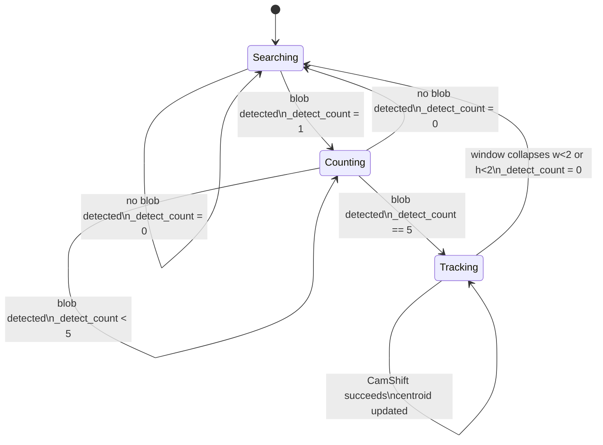
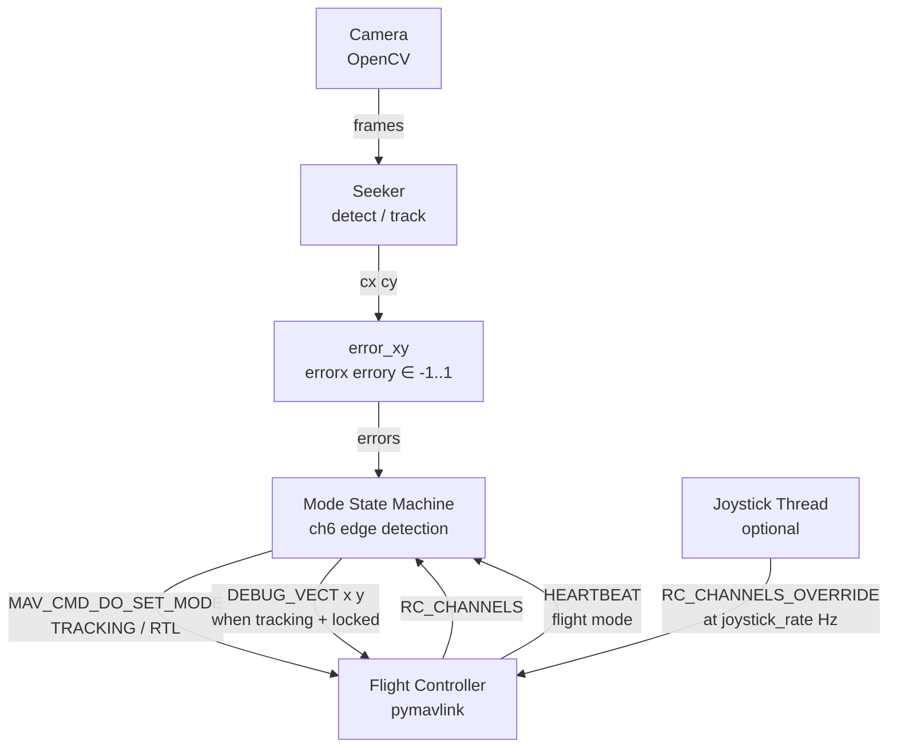
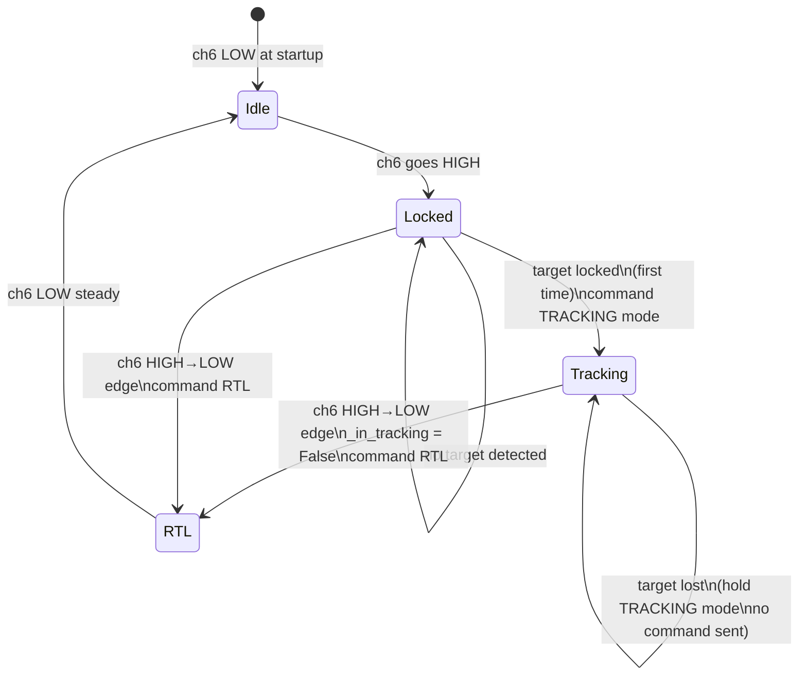

# Tracking and MAVLink Actuation

## Overview

This document covers two layers:

1. **Visual tracking** (`seeker.py`) — state machine and CamShift tracker that converts a detection mask into a stable target centroid.
2. **MAVLink actuation** (`seekerctrl.py`) — flight mode management and error delivery to the ArduPlane flight controller.

---

## Part A — Visual Tracking (`seeker.py`)

### A1. Detection State Machine

Detection alone is noisy. A consecutive-detection counter gates entry into CamShift tracking:

```
if blob detected this frame:
    _detect_count = min(_detect_count + 1, 5)
    _track_win    = blob_rect
else:
    _detect_count = 0
    _track_win    = None

if _detect_count < 5:
    return no-lock     # require 5 consecutive hits before engaging tracker
```

Five consecutive detections must succeed before the tracker activates. A single false-positive cannot engage the tracker.



### A2. CamShift Tracking

Once `_detect_count >= 5`, CamShift runs every frame:

1. Back-project the confidence histogram (`_roi_hist = _conf_hist`) onto the full HSV frame.
2. AND the back-projection with the current detection mask to suppress background.
3. Run `cv2.CamShift` from the last known window.
4. If the window collapses below 2×2 px, drop the lock and reset the counter.

```
back_proj = calcBackProject(hsv, roi_hist) AND detection_mask
_, track_win = CamShift(back_proj, track_win, term_criteria)
```

CamShift iteratively shifts and resizes the window to maximise the back-projection probability within it, producing sub-pixel centroid estimates and a rotation-aware bounding box.

| Collapse guard | Action |
|---|---|
| `w < 2 or h < 2` | Clear `_track_win`, reset `_detect_count = 0` |

### A3. Error Calculation (`error_xy`)

The tracked centroid `(cx, cy)` is normalised to `[-1, 1]`:

```
errorx = (cx - W/2) / (W/2)    positive = target right of centre
errory = (cy - H/2) / (H/2)    positive = target below centre (image Y axis down)
```

`W`, `H` are the frame width and height. These values are sent directly to the flight controller with no clamping.

---

## Part B — MAVLink Actuation (`seekerctrl.py`)

---

## 1. Architecture



---

## 2. MAVLink Connection

```
master = mavutil.mavlink_connection(connection_string, baud=baud)
master.wait_heartbeat()
```

The connection string can be a serial port (`/dev/ttyUSB0`) or a UDP endpoint (`udp:127.0.0.1:14550`). The call blocks until the first HEARTBEAT is received, confirming the flight controller is alive and the target system/component IDs are set.

---

## 3. RC Channel Monitoring

### `_poll_rc()`

Non-blocking drain of all pending `RC_CHANNELS` messages each frame:

```
while recv_match(type="RC_CHANNELS", blocking=False) is not None:
    update rc_channels dict
```

Stores the latest PWM value for each channel in `self.rc_channels`.

### `_ch6_active()`

```
ch6_active = rc_channels["ch6"] >= 1400 pwm
```

Channel 6 is the lock switch for the tracking mode. PWM >= 1400 = locked.

### `_poll_heartbeat()`

Reads the last `HEARTBEAT` stored by pymavlink and maps `custom_mode` to a human-readable name:

| custom_mode | name |
|---|---|
| 5 | LOITER |
| 11 | RTL |
| 27 | TRACKING |
| … | … |

---

## 4. Flight Mode State Machine

The state machine runs once per frame after RC and HEARTBEAT are polled. It enforces five rules:

| ch6 | Target detected | Action |
|---|---|---|
| off (fell) | either | Clear `_in_tracking`, command **RTL** |
| on | yes, first time | Command **TRACKING**, set `_in_tracking = True` |
| on | yes, already tracking | No change |
| on | no | No change (stays in TRACKING) |
| off (already) | either | No repeated command |

### Edge detection

RTL is only sent **once on the falling edge** of ch6, not on every frame while ch6 is low:

```python
ch6_fell = prev_ch6_on and not ch6_on

if ch6_fell:
    _in_tracking = False
    set_mode_rtl()

elif ch6_on and target_locked and not _in_tracking:
    set_mode_tracking()
    _in_tracking = True

prev_ch6_on = ch6_on
```



### Mode commands

Both mode changes use `MAV_CMD_DO_SET_MODE` with `MAV_MODE_FLAG_CUSTOM_MODE_ENABLED`:

```python
master.mav.command_long_send(
    target_system, target_component,
    MAV_CMD_DO_SET_MODE, 0,
    MAV_MODE_FLAG_CUSTOM_MODE_ENABLED,
    custom_mode,          # 27 = TRACKING, 11 = RTL
    0, 0, 0, 0, 0,
)
```

---

## 5. Sending Tracking Errors

### Message format

Tracking errors are sent as the standard MAVLink `DEBUG_VECT` message (ID 250, CRC extra 49), which is present in ArduPlane's compiled `MAVLINK_MESSAGE_CRCS` table:

| Field | Content |
|---|---|
| `name` | `"tracking\x00\x00"` (10-byte padded string) |
| `time_usec` | `monotonic() * 1e6` |
| `x` | `errorx` — normalised horizontal error [-1, 1] |
| `y` | `errory` — normalised vertical error [-1, 1] |
| `z` | `0.0` (unused) |

```python
master.mav.debug_vect_send(
    b"tracking\x00\x00",
    int(time.monotonic() * 1e6),
    errorx, errory, 0.0,
)
```

`DEBUG_VECT` was chosen because custom message IDs outside ArduPlane's compiled message table are silently dropped by the MAVLink parser before reaching the application layer.

### Error normalisation

```
errorx = (cx - W/2) / (W/2)    positive = target right of centre
errory = (cy - H/2) / (H/2)    positive = target below centre
```

### Send condition

Errors are sent only when `_in_tracking` is True and a target is currently locked:

```python
if _in_tracking and target_locked:
    send_tracking(errorx, errory)
```

---

## 6. ArduPlane Reception (`GCS_MAVLink_Plane.cpp`)

`DEBUG_VECT` is dispatched to `handle_tracking_message()` which:

1. Decodes with `mavlink_msg_debug_vect_decode()`.
2. Returns early if not in TRACKING mode.
3. Scales normalised errors to radians using `TRACKING_MAX_DEG` (default 45 deg):

```cpp
float max_rad = tracking_max_deg * (PI / 180.0f);
handle_tracking_error(pkt.x * max_rad, pkt.y * max_rad);
```

4. Stores `_errorx_rad` and `_errory_rad` consumed by `update()`.

---

## 7. ArduPlane PID Loop (`mode_tracking.cpp`)

`ModeTracking::update()` runs each main loop cycle and converts tracking errors to roll and pitch commands.

```mermaid
flowchart TD
    DV[DEBUG_VECT received\nx=errorx  y=errory] --> HM{In TRACKING\nmode?}
    HM -- no --> DROP[discard]
    HM -- yes --> SCALE[Scale to radians\nerror_rad = error × MAX_DEG × π/180]
    SCALE --> STORE[store _errorx_rad\n_errory_rad\nupdate _last_msg_ms]

    STORE --> UPD[update called each loop]
    UPD --> TO{Signal timeout?}
    TO -- yes --> ZERO[nav_roll_cd = 0\nnav_pitch_cd = 0\nreset_I both PIDs]
    TO -- no --> DB1{|ex| > deadband?}

    DB1 -- no  --> RI1[reset_I roll PID\nex = 0]
    DB1 -- yes --> RP[Roll PID update_error\nnav_roll_cd = clamp result]
    RI1 --> RP

    RP --> DB2{|ey| > deadband?}
    DB2 -- no  --> RI2[reset_I pitch PID\ney = 0]
    DB2 -- yes --> PP[Pitch PID update_error\nnav_pitch_cd = clamp result]
    RI2 --> PP

    PP --> THR[Throttle = TRIM_THROTTLE\nconstant]
```

### Deadband

Errors smaller than `TRACKING_DBAND` (default 0.573 deg) are zeroed. The I term is reset inside the deadband to prevent integrator windup:

```cpp
float ex = fabsf(errorx_rad) > deadband ? errorx_rad : 0.0f;
if (ex == 0) tracking_roll_pid.reset_I();

float ey = fabsf(errory_rad) > deadband ? errory_rad : 0.0f;
if (ey == 0) tracking_pitch_pid.reset_I();
```

### Roll PID

```
errorx_rad > 0  →  target right  →  roll right  →  nav_roll_cd > 0
```

Tunable: `TRAK_ROLL_P`, `TRAK_ROLL_I`, `TRAK_ROLL_D`, `TRAK_ROLL_IMAX`

### Pitch PID

```
errory_rad > 0  →  target below  →  nav_pitch_cd adjusted accordingly
```

Tunable: `TRAK_PTCH_P`, `TRAK_PTCH_I`, `TRAK_PTCH_D`, `TRAK_PTCH_IMAX`

### Timeout

If no `DEBUG_VECT` arrives within `TRACKING_TIMEOUT` ms (default 1000 ms), both PIDs reset and roll/pitch commands are zeroed until signal resumes.

### Throttle

Held constant at `TRIM_THROTTLE` percent throughout TRACKING mode.

### Mode exit

On exit, both PID integrators and derivative filters are fully reset:

```cpp
tracking_roll_pid.reset_I();    tracking_roll_pid.reset_filter();
tracking_pitch_pid.reset_I();   tracking_pitch_pid.reset_filter();
```

---

## 8. Joystick RC Override (optional)

When `--joystick` is passed, a dedicated thread reads a gamepad at `joystick_rate` Hz (default 50 Hz) and sends `RC_CHANNELS_OVERRIDE`:

```python
master.mav.rc_channels_override_send(
    target_system, target_component,
    ch1, ch2, ch3, ch4, ch5, ch6,
    UINT16_MAX, UINT16_MAX,   # ch7, ch8 = passthrough
)
```

`UINT16_MAX` (65535) = do not override this channel. On thread stop, all channels are released by sending 0.

---

## 9. Tunable Parameters (ArduPlane)

| Parameter | Default | Description |
|---|---|---|
| `TRACKING_MAX_DEG` | 45 deg | Full-scale error angle — normalised ±1 maps to ±this value in radians |
| `TRACKING_DBAND` | 0.573 deg | Deadband; errors smaller than this are treated as zero |
| `TRACKING_TIMEOUT` | 1000 ms | Signal loss timeout before PIDs reset |
| `TRAK_ROLL_P/I/D` | 200/10/5 | Roll PID gains |
| `TRAK_PTCH_P/I/D` | 100/500/0 | Pitch PID gains |

---

## 10. HUD Overlay

Two lines drawn at the bottom of the display window each frame:

```
MODE: <flight_mode>  LOCK: <ON | OFF | NO TARGET>
FPS: <fps>  ex=<errorx>  ey=<errory>
```

| LOCK value | Meaning |
|---|---|
| `ON` | `_in_tracking = True` |
| `NO TARGET` | ch6 locked but no target detected |
| `OFF` | ch6 not locked |

---

## 11. Key Bindings

| Key | Action |
|---|---|
| `q` | Quit |
| `r` | Reset tracker (`_track_win = None`, `_detect_count = 0`) |
