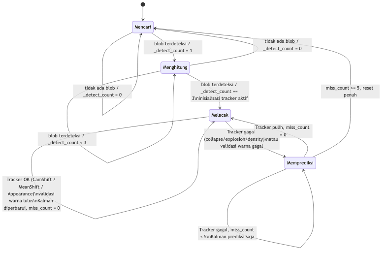
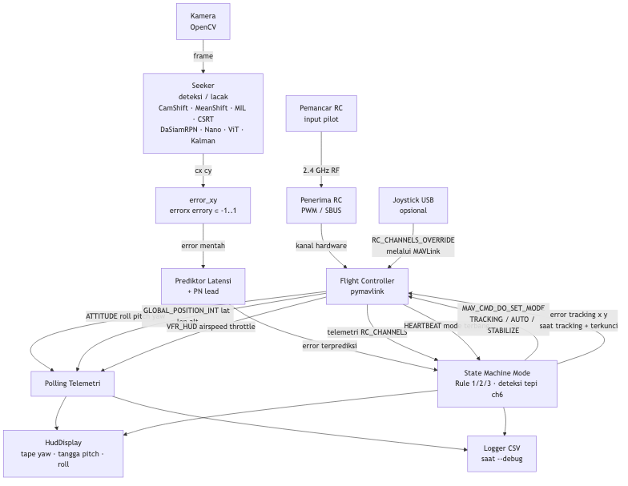
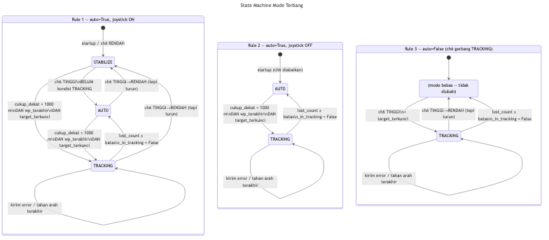
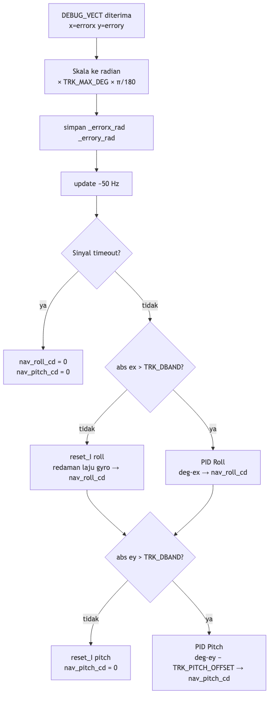

# Tracking dan Aktuasi MAVLink

## Gambaran Umum

Dokumen ini mencakup dua lapisan:

1. **Visual tracking** (`seeker.py`) — state machine dan tracker CamShift yang mengubah mask deteksi menjadi centroid target yang stabil.
2. **Aktuasi MAVLink** (`seekerctrl.py`) — manajemen mode penerbangan dan pengiriman error ke flight controller ArduPlane.

---

## Bagian A — Visual Tracking (`seeker.py`)

### A1. State Machine Deteksi

Deteksi saja bersifat noisy. Pencacah deteksi berurutan mengatur masuk ke tracking CamShift:

```
if blob terdeteksi frame ini:
    _detect_count = min(_detect_count + 1, 3)
    _track_win    = blob_rect
else:
    _detect_count = 0
    _track_win    = None

if _detect_count < 3:
    return no-lock     # butuh 3 hit berurutan sebelum mengaktifkan tracker
```

Tiga deteksi berurutan harus berhasil sebelum tracker diaktifkan. Satu false-positive tidak dapat mengaktifkan tracker.

Saat re-akuisisi (setelah lock sebelumnya hilang), pencarian blob dibatasi pada **ROI yang diperbesar di sekitar jendela terakhir yang diketahui** (`_track_win`), bukan seluruh frame. Area cari = jendela terakhir dipadding sebesar `max(tww, twh, 40)` piksel di setiap sisi. Ini mengurangi beban komputasi dan menghindari salah identifikasi blob yang jauh.



### A2. Tracking CamShift dan MeanShift

Setelah `_detect_count >= 3`, tracker shift berjalan setiap frame. Dua varian tersedia melalui `--tracker camshift` (default) dan `--tracker meanshift`:

- **CamShift** [9, 10, 11] — mengadaptasi posisi, ukuran, dan orientasi window; mengembalikan `cv2.RotatedRect` dan kotak miring yang digambar dengan `cv2.polylines`.
- **MeanShift** [21, 22] — memperbarui posisi saja; ukuran window tetap; mengembalikan `cv2.Rect` axis-aligned dan kotak tegak lurus yang digambar dengan `cv2.rectangle`. Biaya komputasi sedikit lebih rendah.

Pipeline kedua varian identik hingga pemanggilan algoritma akhir:

Setelah `_detect_count >= 3`, tracker shift berjalan setiap frame:

1. Back-project histogram kepercayaan (`_roi_hist = _conf_hist`) ke seluruh frame HSV.
2. **Pre-translate** jendela pencarian berdasarkan kecepatan yang diprediksi Kalman, sehingga CamShift mulai dari dekat posisi target yang diharapkan.
3. **Gate** back-projection ke jendela yang diperbesar (padding `tww/2` dan `twh/2`) — nolkan piksel di luar area — untuk menekan gangguan di luar ROI.
4. GaussianBlur 3×3 pada back-projection untuk memperhalus permukaan probabilitas.
5. Jalankan `cv2.CamShift` dari window terakhir yang diketahui.
6. Klem output window ke batas frame.
7. Validasi window: jika gagal salah satu penjaga di bawah, aktifkan `camshift_bad`.

```
back_proj = calcBackProject(hsv, roi_hist)
back_proj  ← zeroed outside padded search window
GaussianBlur(back_proj, 3×3)
_, track_win = CamShift(back_proj, track_win, term_criteria)
```

CamShift secara iteratif menggeser dan mengubah ukuran window untuk memaksimalkan probabilitas back-projection di dalamnya, menghasilkan estimasi centroid sub-piksel dan bounding box yang sadar rotasi.

| Penjaga | Kondisi | Aksi |
|---|---|---|
| Collapse | `w < 4 or h < 4` | `camshift_bad = True` |
| Explosion | `w > 90% lebar frame or h > 90% tinggi frame` | `camshift_bad = True` |
| Density | `mean(back_proj dalam window) / 255 < 0.05` | `camshift_bad = True` |

### A2a. Prediksi Kalman saat Tracker Gagal

Filter Kalman [19, 20] digunakan sebagai estimator posisi sekunder. Ketika `camshift_bad = True` (atau miss_count meningkat pada tracker penampilan) tetapi filter Kalman sudah diinisialisasi, tracker **tidak langsung mereset**. Sebagai gantinya, Kalman melakukan langkah *predict-only* (tanpa pengukuran) selama hingga `_KF_MISS_MAX = 5` frame berturut-turut:

```
miss_count < _KF_MISS_MAX:
    (kf_x0, kf_x1) ← predict_only(kf_x0, kf_x1, Px, dt)
    (kf_y0, kf_y1) ← predict_only(kf_y0, kf_y1, Py, dt)
    pcx, pcy ← kf_x0, kf_y0   (posisi yang diprediksi)
    track_win ← centred at (pcx, pcy)   (untuk re-akuisisi frame berikutnya)
    return (out, pcx, pcy)   ← tampilan lingkaran oranye

miss_count ≥ _KF_MISS_MAX:
    hard reset: track_win = None, detect_count = 0, kf_initialized = False
    return (out, None, None)
```

Dari perspektif `seekerctrl.py`, frame predict-only mengembalikan `cx, cy` yang valid (bukan `None`), sehingga `target_locked = True` dipertahankan selama jendela prediksi. Ini mencegah mode timeout yang tidak perlu saat target hilang sejenak (mis. karena oklusi atau glare).

| Parameter KF | Nilai | Peran |
|---|---|---|
| `_KF_Q_POS` | 2.0 px²/s | Noise proses — posisi |
| `_KF_Q_VEL` | 80.0 px²/s³ | Noise proses — kecepatan |
| `_KF_R` | 30.0 px² | Noise pengukuran |
| `_KF_MISS_MAX` | 5 frame | Frame predict-only maks sebelum hard reset |

### A2b. Snap Correction

Setelah CamShift berhasil, jika deteksi blob (dari mask) ditemukan dan pusat blob berbeda dari pusat CamShift lebih dari `0.5 × max(bw, bh)`, jendela tracking dikoreksi ke posisi blob. Ini mencegah CamShift "melayang" ke warna serupa di background sementara blob sebenarnya ada di tempat lain.

### A2c. Tracker Berbasis Penampilan (Appearance-Based Trackers)

Sebagai alternatif CamShift/MeanShift, drone-seeker mendukung tracker penampilan pilihan melalui `--tracker [mil|csrt|dasiamrpn|nano|vit]`. Ketika diaktifkan, tracker penampilan diinisialisasi saat `_detect_count == 3` dengan bounding box deteksi, lalu berjalan setiap frame menggantikan CamShift.

| Opsi | Algoritma | Referensi | File model |
|---|---|---|---|
| `mil` | Multiple Instance Learning | [23] | — |
| `csrt` | Channel & Spatial Reliability | [24] | — |
| `dasiamrpn` | Distractor-aware Siamese RPN | [25, 26] | `dasiamrpn_kernel_cls1.onnx`, `dasiamrpn_kernel_r1.onnx`, `dasiamrpn_model.onnx` |
| `nano` | NanoTrack (Siamese ringan) | [27] | `nanotrack_backbone_sim.onnx`, `nanotrack_head_sim.onnx` |
| `vit` | Vision Transformer tracker | [28] | `vitTracker.onnx` |

Karena tracker penampilan tidak mengetahui warna target secara inheren, lapisan **validasi warna** ditambahkan: mask deteksi dijalankan pada ROI yang dikembalikan tracker setiap frame. Jika `countNonZero(roi_mask) < _MIN_BLOB_AREA` untuk `_KF_MISS_MAX` frame berurutan, tracker direset ke mode deteksi.

```
ok, bbox = tracker.update(frame)
if ok:
    roi_mask = detection_mask(frame[bbox])
    if countNonZero(roi_mask) < _MIN_BLOB_AREA:
        miss_count++
        if miss_count >= _KF_MISS_MAX: hard_reset()
        return predict_only()
    miss_count = 0
    # EMA + Kalman update + draw
```

---

### A3. Perhitungan Error (`error_xy`)

Centroid yang dilacak `(cx, cy)` dinormalisasi ke `[-1, 1]`:

```
errorx =  (cx - W/2) / (W/2)    positif = target di kanan tengah
errory = -(cy - H/2) / (H/2)    positif = target di atas tengah
```

`W`, `H` adalah lebar dan tinggi frame. **Negasi pada errory** mengkonversi dari koordinat gambar (sumbu Y mengarah ke bawah) ke konvensi penerbangan (positif = atas). Target di atas crosshair menghasilkan `errory` positif, yang ditafsirkan ArduPlane sebagai "pitch naik untuk mendapatkan target". Nilai-nilai ini dikirim ke flight controller tanpa pemotongan di tahap ini; pemotongan terjadi di prediktor latensi.

---

## Bagian B — Aktuasi MAVLink (`seekerctrl.py`)

---

## 1. Arsitektur



---

## 2. Koneksi MAVLink

```
master = mavutil.mavlink_connection(connection_string, baud=baud)
master.wait_heartbeat()
```

Connection string dapat berupa port serial (`/dev/ttyUSB0`) atau endpoint UDP (`udp:127.0.0.1:14550`). Panggilan ini memblokir hingga HEARTBEAT pertama diterima, mengkonfirmasi bahwa flight controller aktif dan ID sistem/komponen target sudah diset.

---

## 3. Pemantauan Kanal RC

### `_poll_rc()`

Drain non-blocking dari semua pesan `RC_CHANNELS` yang tertunda setiap frame:

```
while recv_match(type="RC_CHANNELS", blocking=False) is not None:
    update rc_channels dict
```

Menyimpan nilai PWM terbaru untuk setiap kanal di `self.rc_channels`.

### `_ch6_active()`

```
ch6_active = rc_channels["ch6"] >= 1400 pwm
```

Kanal 6 adalah saklar kunci untuk mode tracking. PWM >= 1400 = terkunci.

### `_poll_heartbeat()`

Membaca HEARTBEAT terakhir yang disimpan oleh pymavlink dan memetakan `custom_mode` ke nama yang mudah dibaca:

| custom_mode | nama |
|---|---|
| 5 | LOITER |
| 11 | RTL |
| 27 | TRACKING |
| … | … |

---

## 4. State Machine Mode Penerbangan

State machine berjalan sekali per frame setelah RC dan HEARTBEAT di-polling. Ini menerapkan lima aturan:

| ch6 | Target terdeteksi | Aksi |
|---|---|---|
| off (turun) | keduanya | Hapus `_in_tracking`, perintahkan **AUTO** |
| on | ya, pertama kali | Perintahkan **TRACKING**, set `_in_tracking = True` |
| on | ya, sudah tracking | Tidak ada perubahan |
| on | tidak | Tidak ada perubahan (tetap di TRACKING, ArduPlane dead-reckons) |
| off (sudah) | keduanya | Tidak ada perintah berulang |

### Deteksi tepi

AUTO hanya dikirim **sekali pada tepi turun** ch6, bukan setiap frame saat ch6 rendah:

```python
ch6_fell = prev_ch6_on and not ch6_on

if ch6_fell:
    _in_tracking = False
    set_mode_auto()          # custom_mode = 10

elif ch6_on and target_locked and not _in_tracking:
    set_mode_tracking()      # custom_mode = 27
    _in_tracking = True

prev_ch6_on = ch6_on
```



### Perintah mode

Kedua perubahan mode menggunakan `MAV_CMD_DO_SET_MODE` dengan `MAV_MODE_FLAG_CUSTOM_MODE_ENABLED`:

```python
master.mav.command_long_send(
    target_system, target_component,
    MAV_CMD_DO_SET_MODE, 0,
    MAV_MODE_FLAG_CUSTOM_MODE_ENABLED,
    custom_mode,          # 27 = TRACKING, 10 = AUTO
    0, 0, 0, 0, 0,
)
```

---

## 5. Pengiriman Error Tracking

### Format pesan

Error tracking dikirim sebagai pesan MAVLink dari `seekerctrl.py`:

| Field | Isi |
|---|---|
| `x` | `errorx` — error horizontal yang dinormalisasi [-1, 1] |
| `y` | `errory` — error vertikal yang dinormalisasi [-1, 1] |
| `z` | `0.0` (tidak digunakan) |

```python
self.master.mav.debug_vect_send(
    b"tracking\x00\x00",
    int(time.monotonic() * 1e6),
    errorx, errory, 0.0,
)
```

### Normalisasi error

```
errorx =  (cx - W/2) / (W/2)    positif = target di kanan tengah
errory = -(cy - H/2) / (H/2)    positif = target di atas tengah
```

**Catatan tanda**: errory **dinegasikan** — koordinat gambar Y mengarah ke bawah, tapi konvensi penerbangan positif = atas. Target di atas crosshair menghasilkan `errory > 0`, yang ArduPlane terjemahkan sebagai "pitch naik untuk mendapatkan target".

### Kondisi pengiriman

Error hanya dikirim saat `_in_tracking` True dan target saat ini terkunci. Saat lock hilang, **tidak ada yang dikirim** — ArduPlane mendeteksi timeout dan beralih ke dead-reckoning onboard (estimasi LOS yang diintegrasikan gyro):

```python
if _in_tracking and flight_mode == "TRACKING":
    if target_locked:
        # terapkan prediksi latensi + PN lead (lihat Bagian 11)
        errorx, errory = predict(raw_ex, raw_ey, dt, _LATENCY_S + _PN_LEAD_S)
        send_tracking(errorx, errory)
        log_row(...)
    else:
        # lock hilang — kirim (0, 0); ArduPlane timeout dan dead-reckons
        log_row(..., target_locked=False)
```

---

## 6. Penerimaan ArduPlane (`GCS_MAVLink_Plane.cpp`)

Pesan error diterima oleh `handle_tracking_message()` yang:

1. Kembali lebih awal jika tidak dalam mode TRACKING.
2. Menskalakan error yang dinormalisasi ke radian menggunakan `TRK_MAX_DEG` (default 30 deg):

```cpp
float max_rad = tracking_max_deg * (PI / 180.0f);
handle_tracking_error(pkt.x * max_rad, pkt.y * max_rad);
```

4. Menyimpan `_errorx_rad` dan `_errory_rad` yang dikonsumsi oleh `update()`.

---

## 7. Loop PID ArduPlane (`mode_tracking.cpp`)

`ModeTracking::update()` berjalan setiap siklus main loop dan mengubah error tracking menjadi perintah roll dan pitch.



### Settle Ramp

Pada masuk mode atau setelah timeout sinyal, output PID diskalakan dari 0 ke 1 selama `TRK_SETTLE_S` detik untuk menekan transien error awal yang besar:

```cpp
const float elapsed = (now_ms - _lock_stable_ms) * 1e-3f;
ramp = constrain_float(elapsed / settle_s, 0.0f, 1.0f);

// Diterapkan ke output PID roll dan pitch:
roll_cd  = tracking_roll_pid.update_all(degrees(ex),  0.0f, dt_s) * ramp;
pitch_cd = tracking_pitch_pid.update_all(degrees(ey), 0.0f, dt_s) * ramp;
```

### Deadband

Error yang lebih kecil dari `TRK_DBAND` (default 0.573 deg) dinolkan. Term I direset di dalam deadband untuk mencegah integrator windup. Di dalam deadband, laju roll gyro digunakan untuk meredam aktif setiap bank residual:

```cpp
float ex = fabsf(_errorx_rad) > deadband_rad ? _errorx_rad : 0.0f;
if (is_zero(ex)) {
    tracking_roll_pid.reset_I();
    float damp_cd = -(degrees(ahrs.get_gyro().x) * 50.0f) * ramp;
    nav_roll_cd = constrain(damp_cd, ...);
}
```

### Roll PID

```
errorx_rad > 0  →  target kanan  →  roll kanan  →  nav_roll_cd > 0
```

Panggilan PID: `update_all(degrees(ex), 0.0f, dt_s)` — target = error dalam derajat, pengukuran = 0.

Dapat diatur: `TRK_ROLL_P` / `_I` / `_D` / `_IMAX` (default: P=200 cd/deg, I=10, D=5, imax=3000 cd)

### Pitch PID

```
errory_rad > 0  →  target di atas  →  pitch naik  →  nav_pitch_cd > 0
```

Bias cruise konstan `TRK_PITCH_OFFSET` (default 3 deg) dikurangkan dari error pitch sebelum PID, memberikan sikap hidung-naik yang stabil untuk cruise level. Dalam fase terminal, tambahan `TRK_TERM_PTCH` (positif = hidung-turun) ditambahkan untuk melawan momen pitch dari throttle penuh:

```cpp
float pitch_offset_deg = tracking_pitch_offset.get();
if (in_terminal)
    pitch_offset_deg += tracking_term_pitch.get();   // lebih banyak hidung-turun
const float ey = ey_raw - pitch_offset_rad;
pitch_cd = tracking_pitch_pid.update_all(degrees(ey), 0.0f, dt_s) * ramp;
```

Dapat diatur: `TRK_PTCH_P` / `_I` / `_D` / `_IMAX` (default: P=100 cd/deg, I=500, D=0, imax=3000 cd)

### Timeout dan Dead-Reckoning

Jika tidak ada pesan error yang tiba dalam `TRK_TIMEOUT` ms (default 1000 ms), siklus timeout pertama mereset kedua integrator PID dan menolkan nav_roll_cd / nav_pitch_cd (sayap rata):

```cpp
_est_errorx_rad -= ahrs.get_gyro().x * dt_s;   // roll kanan → target bergeser ke kiri
_est_errory_rad -= ahrs.get_gyro().y * dt_s;   // pitch naik → target bergeser ke bawah
_est_errorx_rad *= expf(-dt_s * 0.5f);          // peluruhan ke nol
_est_errory_rad *= expf(-dt_s * 0.5f);
// PID berjalan pada error estimasi — pesawat terus mengarah ke posisi terakhir yang diketahui
```

### Throttle (tiga regime, urutan prioritas)

| Prioritas | Kondisi | Throttle |
|---|---|---|
| 1 | Dalam `TRK_SETTLE_S` sejak akuisisi | `TRIM_THROTTLE` |
| 2 | `TRK_APP_SPD > 0` dan kecepatan udara valid | `cruise + 3 × (target − aktual)` m/s, dibatasi [10, 90]% |
| 3 | Fallback | `TRIM_THROTTLE` konstan |

Saat banking (`|ex| > deadband`), target kecepatan pendekatan dikurangi 20% untuk menghindari overspeed dalam belokan.

### Keluar mode

Saat keluar, kedua integrator PID dan filter derivatif direset sepenuhnya:

```cpp
tracking_roll_pid.reset_I();    tracking_roll_pid.reset_filter();
tracking_pitch_pid.reset_I();   tracking_pitch_pid.reset_filter();
```

---

## 8. RC Transmitter dan Receiver

Pilot menggunakan **RC transmitter fisik** yang terhubung ke **RC receiver** yang dipasang di pesawat. Receiver mengirimkan sinyal kanal (PWM / SBUS) langsung ke flight controller melalui kabel hardware — tidak ada `RC_CHANNELS_OVERRIDE` dari komputer pendamping.

```
RC Transmitter  ──(2.4 GHz RF)──→  RC Receiver  ──(PWM/SBUS)──→  Flight Controller
```

Flight controller meneruskan nilai PWM kanal sebagai pesan `RC_CHANNELS` MAVLink, yang dipoll oleh `seekerctrl.py` setiap frame untuk membaca status ch6 (saklar tracking):

```python
msg = master.recv_match(type="RC_CHANNELS", blocking=False)
ch6_pwm = msg.chan6_raw   # dibaca dari telemetri, bukan di-override
```

Python **hanya membaca** kanal RC — tidak pernah mengirim `RC_CHANNELS_OVERRIDE`. Kontrol roll/pitch/throttle sepenuhnya ditangani oleh ArduPlane melalui PID tracking internal.

---

## 9. Parameter yang Dapat Diatur (ArduPlane)

### Geometri tracking

| Parameter | Default | Keterangan |
|---|---|---|
| `TRK_MAX_DEG` | 30 deg | Sudut error skala penuh — ±1 yang dinormalisasi dipetakan ke ±nilai ini dalam radian |
| `TRK_DBAND` | 0.573 deg | Deadband; error yang lebih kecil diperlakukan sebagai nol |
| `TRK_TIMEOUT` | 1000 ms | Timeout kehilangan sinyal sebelum dead-reckoning diaktifkan |
| `TRK_PITCH_OFFSET` | 3.0 deg | Bias pitch cruise konstan — positif membiaskan hidung ke atas |

### Gain PID

| Parameter | Default | Keterangan |
|---|---|---|
| `TRK_ROLL_P/I/D/IMAX` | 200 / 10 / 5 / 3000 cd | PID Roll: P dalam cdeg/deg, imax dalam cdeg |
| `TRK_PTCH_P/I/D/IMAX` | 100 / 500 / 0 / 3000 cd | PID Pitch |

### Pendekatan dan fase terminal

| Parameter | Default | Keterangan |
|---|---|---|
| `TRK_SETTLE_S` | 2.0 s | Durasi ramp-up setelah masuk mode atau re-akuisisi |
| `TRK_APP_SPD` | 0 m/s | Target kecepatan udara pendekatan; 0 = throttle open-loop |
| `TRK_TERM_ALT` | 0 m | Ambang AGL untuk fase terminal; 0 = nonaktif |
| `TRK_TERM_PTCH` | 0 deg | Bias pitch hidung-turun tambahan dalam fase terminal |
| `TRK_TERM_TREND` | 10 siklus | Jumlah siklus penurunan errory berturut-turut untuk mengaktifkan latch terminal |
| `TRK_TERM_EY` | -0.6 | Ambang errory minimum untuk memicu hitungan trend terminal |

---

## 10. Overlay HUD

Setiap frame menerima dua lapisan anotasi.

### 10.1 Instrumen HUD (`HudDisplay`)

`HudDisplay.draw_hud()` dipanggil dengan telemetri langsung dari ATTITUDE dan GLOBAL_POSITION_INT:

| Elemen | Sumber | Keterangan |
|---|---|---|
| Tape yaw | `_yaw_deg` (ATTITUDE) | Strip kompas horizontal dipusatkan di bawah frame; label N/E/S/W |
| Tangga pitch | `_pitch_deg` (ATTITUDE) | Tanda centang vertikal menunjukkan sudut pitch; garis horizon pada 0° berwarna merah |
| Indikator roll | `_roll_deg` (ATTITUDE) | Arc dan pembacaan sudut bank di atas tampilan pitch |
| Lokasi | `_lat`, `_lon` (GLOBAL_POSITION_INT) | Koordinat desimal dicetak di bawah tape yaw |

Instrumen dikomposit ke frame dengan `addWeighted(frame, 0.6, hud, 0.4, ...)` sehingga overlay tracking tetap terlihat di bawahnya.

### 10.2 Teks status

Tiga baris yang digambar di kiri bawah setiap frame:

```
MODE: <flight_mode>  LOCK: <ON | OFF | NO TARGET>
v: <airspeed>m/s  h: <rel_alt>m  thr: <throttle>%
FPS: <fps>  ex=<errorx>  ey=<errory>
```

| Field | Sumber |
|---|---|
| `flight_mode` | HEARTBEAT `custom_mode` |
| LOCK | Status `_in_tracking` / ch6 |
| `airspeed` | VFR_HUD `airspeed` (m/s) |
| `rel_alt` | GLOBAL_POSITION_INT `relative_alt` (m AGL) |
| `throttle` | VFR_HUD `throttle` (%) |
| `errorx/errory` | Error yang diprediksi (setelah PN lead), hanya saat terkunci |

| Nilai LOCK | Arti |
|---|---|
| `ON` | `_in_tracking = True` |
| `NO TARGET` | ch6 aktif tapi tidak ada target terdeteksi |
| `OFF` | ch6 tidak aktif |

---

## 11. Kompensasi Latensi dan Proportional Navigation Lead

Saat tracker menghitung `errorx` dan `errory` dari centroid frame saat ini, nilai-nilai tersebut sudah menggambarkan posisi target **sesaat yang lalu** — bukan posisi saat ini. Dua penundaan yang tumpang tindih berkontribusi pada keusangan ini:

1. **Latensi pipeline** `τ_L` (≈ 80 ms) — waktu dari penangkapan foton hingga panggilan `send_tracking()`, mencakup eksposur kamera, transfer USB, konversi HSV, iterasi CamShift, dan overhead Python.
2. **Lag aktuasi** — flight controller menerima error, menjalankan update PID, dan airframe merespons dalam waktu terbatas tambahan.

Mengirim error mentah ke kontroler proporsional menyebabkan kontroler selalu bereaksi terhadap posisi yang sudah ditinggalkan target, menghasilkan overshoot sistematis yang memburuk dengan kecepatan sudut target.

### 11.1 Prediktor Taylor Orde Pertama

Prediksi adalah ekstrapolasi maju orde pertama (linear) dari sudut LOS:

```
ė_x = (e_x[k] − e_x[k−1]) / dt
ė_y = (e_y[k] − e_y[k−1]) / dt

T_lead = τ_L + T_PN

ê_x = clamp(e_x[k] + ė_x · T_lead,  −1, +1)
ê_y = clamp(e_y[k] + ė_y · T_lead,  −1, +1)
```

di mana `ê_x`, `ê_y` adalah error yang diprediksi yang dikirim ke flight controller. Ini adalah dua suku pertama dari ekspansi Taylor `e(t)` di sekitar sampel saat ini:

```
e(t + T) ≈ e(t) + ė(t) · T   (Taylor orde pertama, error O(T²))
```

Kondisi `0 < dt < 0.5 s` melindungi dari estimasi derivatif yang basi pada frame drop atau re-akuisisi.

### 11.2 Proportional Navigation Lead

Komponen kedua, `T_PN` (≈ 300 ms), mengimplementasikan hukum panduan **proportional navigation (PN)** yang disederhanakan. PN klasik memerintahkan akselerasi lateral proporsional terhadap laju LOS (line-of-sight) [16, 17]:

```
a_c = N · V_c · λ̇
```

di mana `N` adalah konstanta navigasi (biasanya 3–5), `V_c` adalah kecepatan penutupan, dan `λ̇` adalah laju sudut LOS. Untuk kasus sudut kecil, error yang dinormalisasi mendekati sudut LOS (`e_x ≈ λ_x`), sehingga `ė_x ≈ λ̇_x`. Disubstitusi ke ekspresi PID:

```
u ∝ ê_x = e_x + ė_x · (τ_L + T_PN)
         = e_x + λ̇_x · τ_L  +  λ̇_x · T_PN
          \_____________/     \__________/
           pemulihan latensi     PN lead
```

Produk pertama memulihkan sudut basi yang diinduksi latensi; suku kedua memberikan bias maju proporsional terhadap laju LOS, mengantisipasi posisi target `T_PN` detik ke depan. Ini setara dengan pendekatan **zero-effort-miss (ZEM)** di bawah asumsi kecepatan penutupan dan laju LOS yang kira-kira konstan selama interval lead [17].

"Konstanta" navigasi tidak ditetapkan secara eksplisit di sini; sebaliknya gain PID roll ArduPlane memainkan peran `N · V_c`, dan `T_PN` adalah satu-satunya yang dapat diatur yang mengontrol seberapa agresif seeker memimpin target.

### 11.3 Konstanta Implementasi

| Konstanta | Nilai | Peran |
|---|---|---|
| `_LATENCY_S` | 0.08 s | Perkiraan latensi pipeline — menghilangkan bias sudut basi |
| `_PN_LEAD_S` | 0.30 s | Waktu lead proportional navigation — mengantisipasi gerakan target |
| `T_lead` | 0.38 s | Cakrawala prediksi gabungan (`τ_L + T_PN`) |

```python
# seekerctrl.py — error PN yang dikompensasi latensi
dt_err = now - self._prev_err_t
if 0.0 < dt_err < 0.5:
    dx_dt  = (raw_ex - self._prev_errorx_v) / dt_err
    dy_dt  = (raw_ey - self._prev_errory_v) / dt_err
    lead   = _LATENCY_S + _PN_LEAD_S
    errorx = max(-1.0, min(1.0, raw_ex + dx_dt * lead))
    errory = max(-1.0, min(1.0, raw_ey + dy_dt * lead))
```

### 11.4 Keterbatasan

- Prediktor berorde pertama; target dengan akselerasi sudut tinggi (belokan tajam) menginduksi error prediksi `O(T²)`.
- `_PN_LEAD_S` adalah konstanta tetap; hukum PN penuh akan menyesuaikan `T_lead` sebagai fungsi perkiraan time-to-go, yang berkurang dalam fase terminal. Dalam praktiknya, regime throttle penuh di fase terminal mempersingkat waktu intersep dan error residual kecil relatif terhadap ukuran target fisik.
- Derivatif `ė` dihitung dari timestamp frame berurutan; pada frame rate rendah (< 10 fps) noise pada `ė` dapat melebihi sinyal. Penjaga `dt < 0.5 s` menonaktifkan prediksi pada frame tersebut.

---

## 12. Tombol Pintasan

| Tombol | Aksi |
|---|---|
| `q` | Keluar |
| `r` | Reset tracker (`_track_win = None`, `_detect_count = 0`) |
