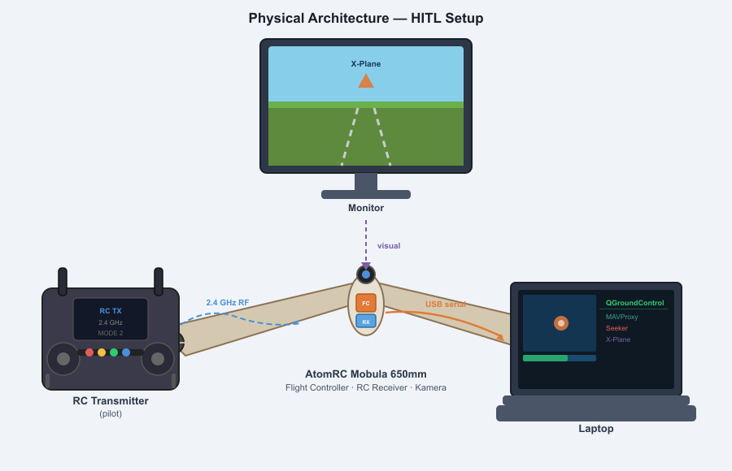
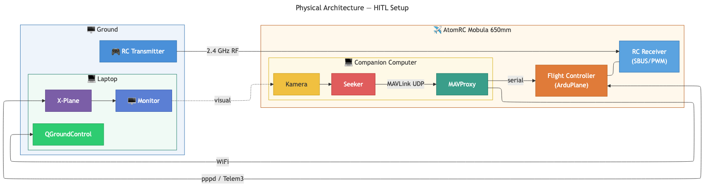
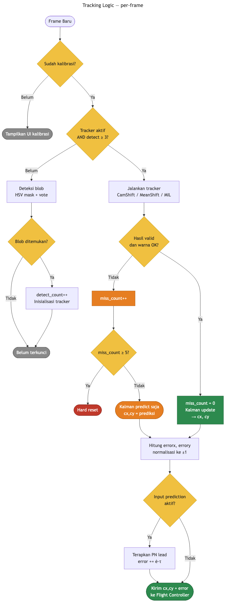
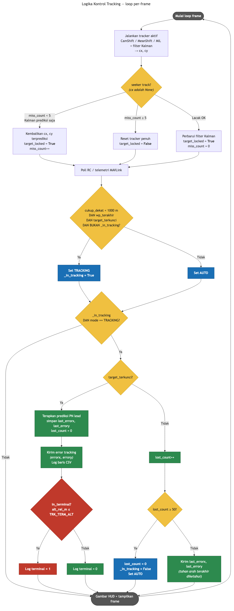
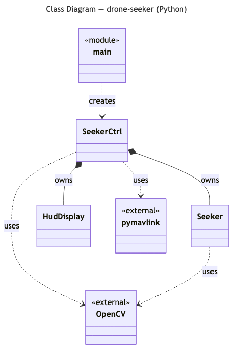

# Metodologi Penelitian

## 1. Gambaran Umum Sistem

Penelitian ini merancang dan mengimplementasikan sistem seeker otonom berbasis visual yang dipasang pada drone fixed-wing ArduPlane. Sistem terdiri dari dua subsistem utama yang berjalan pada companion computer:

1. **Pipeline deteksi dan tracking visual** (`seeker.py`) — memproses frame kamera secara real-time untuk mendeteksi dan melacak target berwarna hot-pink, menghasilkan koordinat centroid target `(cx, cy)`.
2. **Kontroler aktuasi MAVLink** (`seekerctrl.py`) — mengonsumsi centroid dari seeker, menghitung sinyal error, dan mengirimkannya ke flight controller ArduPlane melalui protokol MAVLink untuk menggerakkan PID tracking onboard.

Tata letak fisik komponen pada airframe ditunjukkan pada Gambar 1, arsitektur fisik koneksi antar perangkat keras pada Gambar 2, dan arsitektur perangkat lunak keseluruhan pada Gambar 3.



**Gambar 1 — Tata Letak Fisik.** Kamera dipasang di hidung airframe menghadap ke depan untuk memberikan sudut pandang sesuai arah terbang. Companion computer (Raspberry Pi / Orange Pi) ditempatkan di badan pesawat dan terhubung ke kamera via USB serta ke flight controller via kabel serial. Flight controller menerima sinyal RC dari receiver yang terpasang terpisah.



**Gambar 2 — Arsitektur Fisik (HITL Setup).** Pilot mengoperasikan RC transmitter yang mengirim sinyal 2.4 GHz ke RC receiver di airframe; receiver meneruskan sinyal kanal (SBUS/PWM) langsung ke flight controller tanpa melewati companion computer. Kamera menangkap frame dan mengirimkannya ke `Seeker` di companion computer; output MAVLink dari `Seeker` diteruskan melalui MAVProxy ke flight controller via serial. Untuk keperluan simulasi Hardware-in-the-Loop (HITL), flight controller juga terhubung ke X-Plane di laptop melalui link PPP/Telem3, dan MAVProxy membuka port WiFi untuk monitoring QGroundControl.


**Gambar 3 — Arsitektur Perangkat Lunak.** `seeker.py` memproses frame kamera secara real-time dan mengeluarkan centroid target `(cx, cy)`. `seekerctrl.py` (kontroler utama) mengonsumsi centroid tersebut, menghitung error yang dinormalisasi, menerapkan kompensasi latensi dan PN lead, lalu mengirim pesan `TRACKING_MESSAGE` ke flight controller. Secara paralel, `seekerctrl.py` mem-poll pesan `RC_CHANNELS` dan `HEARTBEAT` dari flight controller untuk mengelola transisi mode penerbangan (AUTO ↔ TRACKING) berdasarkan posisi saklar ch6 dan status lock target.

---

## 2. Pemilihan Warna Target dan Kalibrasi

Target dipilih berwarna **hot-pink** (magenta terang) karena kontrasnya yang tinggi terhadap latar belakang lingkungan outdoor umum (langit biru, vegetasi hijau, tanah cokelat). Ruang warna **HSV** (Hue–Saturation–Value) dipilih sebagai basis representasi karena memisahkan informasi kromatik dari luminansi, sehingga identitas warna target tidak berubah secara signifikan saat intensitas dan sudut pencahayaan matahari berubah selama penerbangan [1, 2].

### 2.1 Kalibrasi Histogram Hue

Sebelum penerbangan, operator menjalankan `calibrate_color.py` untuk membangun model warna sesuai kondisi pencahayaan aktual:

1. Kamera diarahkan ke target hot-pink di lapangan.
2. Sistem mendeteksi blob menggunakan rentang HSV fallback yang dikodekan.
3. Histogram hue 180-bin diakumulasikan dari region blob yang terdeteksi.
4. Histogram dinormalisasi dan disimpan ke `color_histogram.txt`.

Karena hue adalah besaran sirkular (nilai 0 dan 179 secara perceptual berdekatan), rata-rata dan standar deviasi hue dihitung menggunakan **statistik sirkular** [4, 5]:

- Setiap bin hue dipetakan ke vektor satuan pada lingkaran satuan.
- Rata-rata sirkular `μ` dihitung dari resultan vektor berbobot.
- Standar deviasi sirkular `σ` diturunkan dari besaran resultan tersebut.

Hasilnya digunakan untuk membangun **histogram kepercayaan** yang hanya memberikan bobot penuh pada bin dalam `±3σ` dari `μ`, menekan semua hue lain ke nol.


---

## 3. Pipeline Deteksi Warna

### 3.1 Fast Path saat Target Terkunci

Ketika tracker sudah aktif dan target terkunci (`detect_count ≥ 3`), hanya **Metode inRange** yang dijalankan dengan satu operasi `MORPH_CLOSE` kernel elips 3×3. MORPH_CLOSE (dilasi lalu erosi) menutup celah kecil dalam blob tanpa memerlukan dua operasi terpisah. Path ini ±3–4× lebih cepat dari pipeline penuh dan cukup karena target sudah dikonfirmasi.

### 3.2 Tiga Metode Deteksi Independen

Pada fase akuisisi, tiga metode dijalankan secara independen dan hasilnya digabungkan dengan **voting mayoritas** (minimal 2 dari 3 setuju):

| Metode | Pendekatan | Keunggulan |
|---|---|---|
| **Back-projection Gaussian** | `calcBackProject` dengan histogram kepercayaan pada kanal hue yang di-blur Gaussian 5×5 [3] | Robust terhadap variasi hue gradual |
| **Threshold Adaptif** | `adaptiveThreshold` pada kanal hue (blockSize=11) di-gate dengan LUT hue [7, 8] | Robust terhadap iluminasi tidak merata |
| **Dual inRange** | Band HSV core (μ±1σ) dan outer (μ±3σ); piksel outer mendapat bobot setengah | Cepat, deterministik |

Voting mayoritas memberikan hasil `mask` yang lebih tahan terhadap false positive dibanding metode tunggal mana pun.

### 3.3 Pembersihan Morfologis

Setelah voting, dua operasi morfologis diterapkan secara berurutan menggunakan kernel elips 5×5 [12]:

1. **`MORPH_OPEN`** (erosi → dilasi) — menghilangkan noise salt-and-pepper dan piksel positif terisolasi yang lolos voting namun terlalu kecil untuk menjadi blob valid.
2. **`MORPH_DILATE`** — memperluas region yang tersisa untuk mengisi lubang kecil di dalam blob dan menggabungkan fragmen yang berdekatan.

### 3.4 Seleksi Blob

`cv2.findContours` mengekstrak kandidat blob dari mask. Setiap kandidat difilter dengan lima kriteria bentuk (area minimum, dimensi minimum, rasio aspek, extent, solidity), lalu dinilai dengan:

```
skor = solidity × extent × area
```

Blob dengan skor tertinggi dipilih sebagai estimasi posisi target.


---

## 4. Visual Tracking

### 4.1 State Machine Akuisisi

Untuk mencegah false positive tunggal mengaktifkan tracker, sistem membutuhkan **tiga deteksi berurutan** sebelum tracker diinisialisasi:

```
blob terdeteksi → detect_count++
blob tidak terdeteksi → detect_count = 0
detect_count ≥ 3 → aktifkan tracker
```

Saat re-akuisisi, pencarian blob dibatasi pada ROI yang diperbesar di sekitar jendela tracking terakhir, bukan seluruh frame, untuk mengurangi beban komputasi dan menghindari salah identifikasi.


### 4.2 Tracker Shift (CamShift dan MeanShift)

Setelah `detect_count ≥ 3`, tracker shift berjalan setiap frame menggunakan back-projection histogram kepercayaan Gaussian:

1. **Pre-translate** jendela pencarian berdasarkan kecepatan yang diprediksi filter Kalman.
2. **Gate** back-projection ke jendela yang diperbesar — nolkan piksel di luar area.
3. GaussianBlur 3×3 untuk memperhalus permukaan probabilitas.
4. Jalankan algoritma shift.
5. Klem output ke batas frame.
6. Validasi: window collapse, explosion, atau density rendah → aktifkan `camshift_bad`.

Dua varian tersedia:

- **CamShift** [9, 10, 11] — mengadaptasi posisi, ukuran, dan orientasi window; default.
- **MeanShift** [21, 22] — memperbarui posisi saja; ukuran window tetap; biaya komputasi lebih rendah.

Jika pusat blob dari mask HSV berbeda lebih dari `0.5 × max(bw, bh)` dari pusat tracker, jendela tracking dikoreksi ke posisi blob (**snap correction**) untuk mencegah tracker melayang ke warna serupa di background.

### 4.3 Tracker Berbasis Penampilan (MIL)

Sebagai alternatif, `--tracker mil` mengaktifkan tracker MIL (Multiple Instance Learning) [23]. MIL menggunakan classifier MILBoost online yang memperbarui model penampilan setiap frame dari "bag" patch kandidat, sehingga tahan terhadap estimasi posisi yang sedikit meleset.

Karena MIL tidak mendeteksi kehilangan target secara inheren, sistem menambahkan validasi warna dua lapis:
- **Gate warna per-frame**: mask HSV dijalankan pada ROI tracker; jika piksel warna < `_MIN_BLOB_AREA`, frame dihitung miss.
- **Counter toleransi**: jika `miss_count ≥ _KF_MISS_MAX` (5 frame ≈ 150 ms), tracker direset.

### 4.4 Filter Kalman sebagai Estimator Sekunder

Filter Kalman 1D [19, 20] diterapkan terpisah pada sumbu x dan y dengan state `[posisi, kecepatan]`. Ketika tracker utama gagal (`camshift_bad` atau miss_count meningkat), Kalman melakukan langkah **predict-only** selama hingga 5 frame sebelum hard reset. Ini mempertahankan estimasi posisi yang kontinu selama oklusi singkat tanpa memicu perubahan mode yang tidak perlu.

| Parameter | Nilai |
|---|---|
| Noise proses posisi | 2.0 px²/s |
| Noise proses kecepatan | 80.0 px²/s³ |
| Noise pengukuran | 30.0 px² |
| Frame predict-only maks | 5 frame |



---

## 5. Perhitungan Error dan Kompensasi Latensi

### 5.1 Normalisasi Error

Centroid `(cx, cy)` dinormalisasi ke `[-1, 1]` relatif terhadap pusat frame:

```
errorx =  (cx - W/2) / (W/2)    positif = target di kanan
errory = -(cy - H/2) / (H/2)    positif = target di atas
```

Negasi pada `errory` mengonversi dari koordinat gambar (Y ke bawah) ke konvensi penerbangan (positif = atas).

### 5.2 Kompensasi Latensi dan Proportional Navigation Lead

Pipeline memiliki latensi inheren `τ_L ≈ 80 ms` dari penangkapan foton hingga pengiriman error (eksposur kamera, transfer USB, konversi HSV, iterasi CamShift, overhead Python). Mengirim error mentah menyebabkan kontroler selalu bereaksi terhadap posisi yang sudah ditinggalkan target.

Solusi yang diterapkan adalah **prediktor Taylor orde pertama** yang menggabungkan pemulihan latensi dan hukum panduan **Proportional Navigation (PN)** [15, 16, 17]:

```
ė_x = (e_x[k] − e_x[k−1]) / dt
T_lead = τ_L + T_PN
ê_x = clamp(e_x[k] + ė_x · T_lead, −1, +1)
```

dengan `T_PN = 0.30 s` sebagai lead PN. Suku `ė_x · τ_L` memulihkan sudut basi akibat latensi pipeline, sementara suku `ė_x · T_PN` mengimplementasikan bias maju PN yang mengantisipasi posisi target ke depan — setara dengan panduan **zero-effort-miss (ZEM)** [17, 18].

---

## 6. Komunikasi MAVLink

Error tracking `(ê_x, ê_y)` dikirim ke flight controller sebagai pesan MAVLink `TRACKING_MESSAGE` (ID 11045) setiap frame menggunakan protokol MAVLink [13, 14]:

```python
master.mav.debug_vect_send(b"tracking\x00\x00", timestamp, errorx, errory, 0.0)
```

Pemilihan ID pesan kustom yang terdaftar dalam dialek ardupilotmega penting karena `mavlink_get_msg_entry()` secara diam-diam membuang pesan dengan ID yang tidak terdaftar dalam tabel yang dikompilasi — ID non-standar (229, 230, 202) terbukti tidak diterima.

---

## 7. State Machine Mode Penerbangan

Kontroler mengelola transisi antara mode **AUTO** dan **TRACKING** ArduPlane berdasarkan lima kondisi:

| ch6 RC | Target terkunci | Aksi |
|---|---|---|
| off (tepi turun) | — | Set **AUTO**, hapus `_in_tracking` |
| on | Ya, pertama kali | Set **TRACKING**, `_in_tracking = True` |
| on | Ya, sudah tracking | Tidak ada perubahan |
| on | Tidak | Tidak ada perubahan (ArduPlane dead-reckons) |
| off (sudah) | — | Tidak ada perintah berulang |

Perintah AUTO hanya dikirim **sekali pada tepi turun** ch6 (falling-edge detection) untuk mencegah banjir perintah.


---

## 8. Penerimaan dan PID ArduPlane

ArduPlane menerima error di `handle_tracking_message()`, menskalakan ke radian menggunakan `TRK_MAX_DEG` (default 30°), lalu `ModeTracking::update()` menjalankan PID roll dan pitch setiap siklus main loop:

- **Settle ramp**: output PID diskalakan 0→1 selama `TRK_SETTLE_S = 2 s` setelah masuk mode untuk menekan transien awal.
- **Deadband**: error < `TRK_DBAND = 0.573°` dinolkan; integrator direset di dalam deadband.
- **Timeout**: jika tidak ada pesan selama `TRK_TIMEOUT = 1000 ms`, ArduPlane melakukan dead-reckoning berbasis integrasi gyro.
- **Throttle**: dikelola dalam tiga regime (settle → kecepatan udara → fallback trim throttle).


---

## 9. Alur Kontrol Per-Frame (Loop Utama)

Setiap frame `drone_seeker.py` menjalankan urutan berikut:

1. Baca `(cx, cy)` dari seeker; update `miss_count` dan `target_locked`.
2. Poll RC (`ch6`) dan telemetri MAVLink (heartbeat, altitude, airspeed).
3. Evaluasi transisi mode (AUTO ↔ TRACKING).
4. Jika `_in_tracking` dan target terkunci: terapkan PN lead → kirim error → log CSV → cek kondisi terminal.
5. Jika target hilang `≥ 50 frame`: paksa kembali ke AUTO.
6. Gambar HUD dan tampilkan frame.



---

## 10. Pengembangan Perangkat Lunak Seeker dengan Python

### 10.1 Pemilihan Bahasa Pemrograman

Sistem seeker dikembangkan menggunakan bahasa pemrograman **Python 3** dengan pertimbangan sebagai berikut:

- **Ekosistem computer vision** — library OpenCV (`cv2`) tersedia sebagai binding Python yang matang dan teruji, mencakup seluruh kebutuhan pipeline dari konversi ruang warna, back-projection histogram, tracker CamShift/MeanShift/MIL, hingga filter morfologis.
- **Integrasi MAVLink** — library `pymavlink` menyediakan antarmuka Python lengkap untuk seluruh pesan MAVLink (parsing, pengiriman, polling) tanpa perlu mengimplementasikan framing protokol secara manual.
- **Produktivitas pengembangan** — Python memungkinkan iterasi cepat pada parameter algoritma (threshold HSV, koefisien Kalman, konstanta PN) tanpa siklus kompilasi, yang penting pada tahap tuning di lapangan.
- **Portabilitas pada companion computer** — Python 3 tersedia secara native pada platform ARM (Raspberry Pi, Orange Pi) yang umum digunakan sebagai companion computer pada drone, tanpa dependensi toolchain tambahan.

### 10.2 Dependensi Utama

| Library | Versi | Peran |
|---|---|---|
| `opencv-python` | ≥ 4.5 | Pipeline deteksi warna, tracker visual, rendering HUD |
| `numpy` | ≥ 1.21 | Operasi array pada mask, histogram, dan filter Kalman |
| `pymavlink` | ≥ 2.4 | Koneksi MAVLink, polling RC/telemetri, pengiriman error |
| `python-dotenv` | opsional | Konfigurasi parameter dari file `.env` |

### 10.3 Struktur Kelas

Sistem seeker diorganisasikan ke dalam tiga kelas utama ditambah satu modul entry-point:



**Gambar — Class Diagram drone-seeker.** Modul `main` (entry-point) membuat satu instance `SeekerCtrl`. `SeekerCtrl` memiliki (_owns_) instance `Seeker` dan `HudDisplay`, serta menggunakan library eksternal `pymavlink` dan `OpenCV` secara langsung. `Seeker` menggunakan `OpenCV` untuk seluruh operasi computer vision-nya.

#### `Seeker` (`seeker.py`)

Bertanggung jawab atas seluruh pipeline computer vision per-frame:

- Memuat dan memvalidasi histogram kalibrasi warna dari `color_histogram.txt`; jika tidak ada, menggunakan rentang HSV fallback.
- Menjalankan pipeline deteksi tiga metode (back-projection Gaussian, threshold adaptif, dual inRange) dengan voting mayoritas.
- Mengelola state machine akuisisi (`_detect_count`, `_track_win`) dan inisialisasi tracker.
- Menjalankan tracker CamShift, MeanShift, atau MIL setiap frame; menerapkan snap correction dan filter Kalman.
- Menghitung `errorx` dan `errory` yang dinormalisasi dan mengembalikan `(cx, cy)` ke kontroler.

#### `SeekerCtrl` (`seekerctrl.py`)

Kontroler utama yang mengorkestrasi seluruh loop per-frame:

- Membuka koneksi MAVLink dan menunggu HEARTBEAT pertama dari flight controller.
- Memanggil `Seeker.process_frame()` setiap frame untuk mendapatkan centroid target.
- Mem-poll pesan `RC_CHANNELS` dan `HEARTBEAT` untuk membaca status ch6 dan mode penerbangan aktif.
- Mengevaluasi state machine mode (AUTO ↔ TRACKING) dan mengirim perintah `MAV_CMD_DO_SET_MODE`.
- Menerapkan kompensasi latensi dan PN lead pada error, lalu mengirim `TRACKING_MESSAGE` ke flight controller.
- Menulis log baris CSV setiap frame yang aktif tracking (timestamp, error, mode, altitude, terminal flag).

#### `HudDisplay` (`hud.py`)

Menggambar overlay instrumen pada frame output:

- Tape yaw, tangga pitch, dan indikator roll dari data `ATTITUDE` MAVLink.
- Koordinat GPS dari `GLOBAL_POSITION_INT`.
- Baris status teks: mode penerbangan, status lock, airspeed, altitude relatif, throttle, FPS, dan nilai error.
- Komposit overlay dengan `cv2.addWeighted` agar anotasi tracking tetap terlihat di bawahnya.

### 10.4 Alur Pengembangan dan Pengujian

Pengembangan dilakukan dalam dua lingkungan:

1. **Simulasi HITL (Hardware-in-the-Loop)** — Flight controller fisik terhubung ke X-Plane via PPP/Telem3. Kamera menghadap monitor yang menampilkan tampilan X-Plane, sehingga seeker memproses gambar simulasi secara nyata. Ini memungkinkan validasi seluruh pipeline (deteksi → tracking → MAVLink → PID ArduPlane) tanpa risiko terbang.
2. **Pengujian lapangan** — Drone terbang di area terbuka dengan target hot-pink fisik di darat. Parameter yang divalidasi di simulasi (threshold warna, konstanta Kalman, `_LATENCY_S`, `_PN_LEAD_S`) diterapkan langsung tanpa modifikasi kode.
