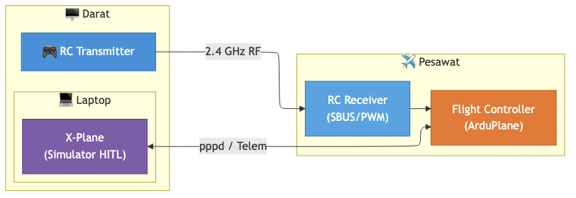
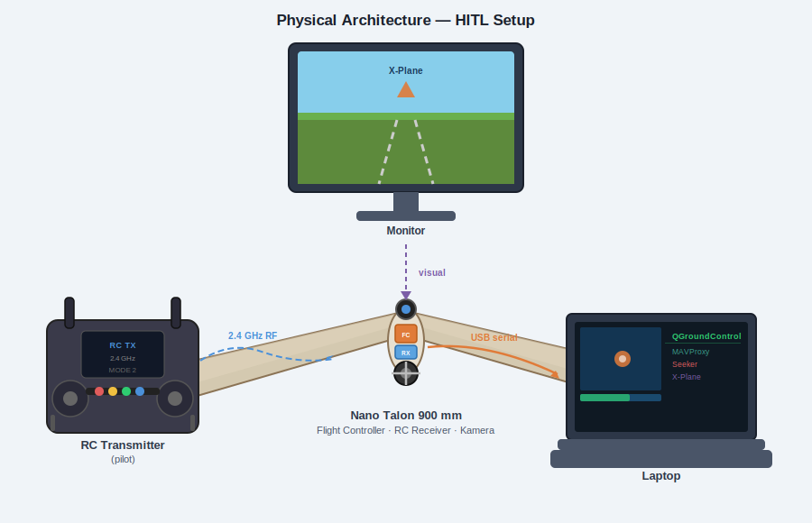

# HITL Setup — ArduPlane fmuv3-hil + X-Plane 11/12

Hardware-in-the-Loop (HITL) using a Pixhawk v2 (fmuv3) running custom
ArduPlane firmware.  X-Plane provides the flight model; the Pixhawk runs
the real autopilot code.  All sensor injection and actuator output are
handled **inside the firmware** via the SITL XPlane backend — no bridge
script or MAVProxy is required.

---

## Architecture



### Data flow

| Direction | Path | Content |
|-----------|------|---------|
| X-Plane → Pixhawk | UDP → PPP (TELEM2) | DATA@ rows (IMU, GPS, airspeed, attitude) |
| Pixhawk → X-Plane | PPP (TELEM2) → UDP | DREF packets (yoke ratios, throttle, overrides) |
| QGC ↔ Pixhawk | USB (SERIAL0) | MAVLink2 telemetry, parameters, mission |
| RC Transmitter → RC Receiver → Pixhawk | 2.4 GHz radio + SBUS/PPM | RC stick input |

The **SITL XPlane backend** (`SIM_XPlane.cpp`) runs on the Pixhawk and:
- Decodes incoming DATA@ rows to populate `SIMState` (sensor injection)
- Reads `input.servos[]` each cycle and sends DREF packets to X-Plane
- Uses `xplane_plane.json` (embedded in firmware ROMFS) to map servo channels
  to X-Plane yoke/throttle DREFs

---

## Physical setup



## Physical connections

| Cable | From | To |
|-------|------|----|
| USB-A → micro-B | PC | Pixhawk USB (SERIAL0) |
| USB–UART adapter | PC (pppd) | Pixhawk TELEM2 (SERIAL2) at 115200 baud |

X-Plane and QGC both run on the same PC.

---

## Prerequisites

```bash
pip3 install pymavlink
```

- **Firmware**: ArduPlane built for `fmuv3-hil`. Flash once via Mission Planner
  or `uploader.py`. The `defaults.parm` is embedded and applied on clean EEPROM.
- **X-Plane 11 or 12**: running, fixed-wing aircraft loaded, sim unpaused.

---

## Step 1 — Configure X-Plane networking

X-Plane must send sensor DATA@ directly to the Pixhawk's PPP address and
accept DREF commands back.  Configure once in X-Plane (it saves the setting):

**Settings → Net Connections → Data:**

| Field | Value |
|-------|-------|
| Send data to IP | `10.0.0.2` |
| Send data port | `49001` |
| Receive commands port | `49000` |

Enable the following DATA@ rows (**Settings → Data Output**, tick
"Send data over the net"):

| Row # | Name | Used for |
|-------|------|----------|
| 1 | Frame rate / sim time | timing |
| 3 | Speeds | IAS → airspeed sensor |
| 4 | G-load | body-frame accelerations → IMU |
| 16 | Angular velocities | roll/pitch/yaw rates → gyro |
| 17 | Pitch, roll, heading | attitude → EKF |
| 20 | Lat, lon, altitude | GPS position |
| 21 | Loc, vel, dist | NED velocity → GPS velocity |

---

## Step 2 — Start the PPP tunnel

Connect the USB–UART adapter to the Pixhawk TELEM2 port.  Find its device
name, then start `pppd`:

```bash
# macOS
sudo pppd /dev/tty.usbserial-XXXX 115200 \
  10.0.0.1:10.0.0.2 \
  noauth local nodetach \
  asyncmap 0 novj nopcomp noaccomp \
  lcp-echo-interval 0
```

```bash
# Linux
sudo pppd /dev/ttyUSB0 115200 \
  10.0.0.1:10.0.0.2 \
  noauth local nodetach \
  asyncmap 0 novj nopcomp noaccomp \
  lcp-echo-interval 0
```

| IP | Host |
|----|------|
| `10.0.0.1` | PC (X-Plane side) |
| `10.0.0.2` | Pixhawk |

Keep this terminal open.  Once the Pixhawk boots and the firmware initialises
the PPP interface, `pppd` will print `local  IP address 10.0.0.1`.

> **pppd flags:**
> `asyncmap 0` — no control-char escaping (~20 % bandwidth saving at 115200)
> `novj` — disable VJ TCP header compression (reduces latency)
> `nopcomp noaccomp` — disable PPP header compression (simpler framing)
> `lcp-echo-interval 0` — disable LCP keepalive (firmware does not reply to
> LCP Echo-Requests; without this pppd drops with "Peer not responding" after ~12 s)

---

## Step 3 — Connect QGroundControl

Plug the Pixhawk USB into the PC.  Open **QGroundControl** — it
auto-connects via USB at 921600 baud (SERIAL0).

You should see:
- Vehicle connected (ArduPlane)
- Parameters loaded
- Flight mode (e.g. MANUAL)

Use QGC for mode changes, mission upload, parameter tuning, and arming.

---

## Step 4 — Unpause X-Plane

Press **P** (or click the pause button) in X-Plane to start the simulation.

Once unpaused:
- The Pixhawk starts receiving DATA@ rows over PPP and injecting sensor data
- The EKF initialises (GPS fix visible in QGC within a few seconds)
- Control surface DREF packets flow from the Pixhawk to X-Plane at ~25 Hz

### Verify

In QGC you should see:
- GPS position matching the X-Plane aircraft location
- Attitude (roll/pitch/heading) matching the X-Plane cockpit
- Airspeed updating as X-Plane airspeed changes

---

## Step 5 — Arm and fly

Power on the RC transmitter and confirm the RC receiver (connected to the
Pixhawk RC input via SBUS or PPM) shows a link.  Arm via QGC or the RC
transmitter arming sequence.

---

## Parameter notes

All required parameters are in `defaults.parm` (embedded in firmware).
Key values:

| Parameter | Value | Purpose |
|-----------|-------|---------|
| `GPS1_TYPE` | 100 | SITL GPS backend (reads from SIMState / X-Plane) |
| `ARSPD_TYPE` | 100 | SITL airspeed backend |
| `AHRS_EKF_TYPE` | 2 | EKF2 (stable on STM32F427 with SITL backend) |
| `BRD_SAFETY_DEFLT` | 0 | No safety switch in simulation |
| `ARMING_SKIPCHK` | -1 | Skip all pre-arm checks |
| `THR_FAILSAFE` | 0 | Disable RC/throttle failsafe |
| `RC_OVERRIDE_TIME` | -1 | No timeout on RC_CHANNELS_OVERRIDE |
| `SERIAL0_PROTOCOL` | 2 | USB = MAVLink2 (QGC) |
| `SERIAL2_PROTOCOL` | 48 | TELEM2 = PPP |
| `SERIAL2_BAUD` | 115 | 115200 baud for PPP |
| `NET_ENABLE` | 1 | Enable lwIP networking |
| `NET_OPTIONS` | 64 | Disable PPP LCP echo limit |
| `SCHED_LOOP_RATE` | 50 | 50 Hz prevents watchdog on STM32F427 |
| `SIM_OH_MASK` | 255 | Pass all servo channels through SITL |
| `TKOFF_THR_MINACC` | 0 | No acceleration check before throttle-up |
| `TKOFF_THR_MINSPD` | 0 | No GPS speed check before throttle-up |
| `GROUND_STEER_ALT` | 5 | Ground steering active below 5 m AGL |

### TRACKING parameters

| Parameter | Default | Purpose |
|-----------|---------|---------|
| `TRAK_ROLL_P` | 200 | cd per degree of horizontal error |
| `TRAK_ROLL_I` | 10 | roll integral |
| `TRAK_ROLL_D` | 5 | roll derivative |
| `TRAK_PTCH_P` | 100 | cd per degree of vertical error |
| `TRAK_PTCH_I` | 500 | pitch integral |
| `TRAK_PTCH_D` | 0 | pitch derivative |
| `TRACKING_MAX_DEG` | 3.0 | max roll/pitch delta at full-scale error ±1 (deg) |
| `TRACKING_DBAND` | 0.573 | error deadband before PID (deg, ~0.01 rad) |
| `TRACKING_TIMEOUT` | 1000 | signal loss timeout before holding level (ms) |

### DREF mapping (xplane_plane.json)

The firmware embeds `xplane_plane.json` which maps servo channels to X-Plane
DREFs via `override_joystick`:

| Channel | DREF | Type |
|---------|------|------|
| CH1 (aileron) | `sim/joystick/yoke_roll_ratio` | angle (−1…+1) |
| CH2 (elevator) | `sim/joystick/yoke_pitch_ratio` | angle_neg (inverted) |
| CH3 (throttle) | `sim/flightmodel/engine/ENGN_thro_use[0]` | range (0…1) |
| CH4 (rudder) | `sim/joystick/yoke_heading_ratio` | angle (−1…+1) |

---

## Troubleshooting

| Symptom | Likely cause | Fix |
|---------|-------------|-----|
| pppd "Peer not responding" | LCP echo not disabled | Add `lcp-echo-interval 0` to pppd command |
| pppd connects but X-Plane gets no data | Wrong IP in X-Plane net config | Set send IP to `10.0.0.2`, port `49001` |
| QGC shows no GPS | EKF not converged | Check `SIM_OPOS_*` params match X-Plane location; ensure X-Plane unpaused |
| Controls don't move in X-Plane | Override DREFs timed out | Firmware resends overrides every ~1 s automatically |
| Throttle stays at 0 when armed | RANGE DREFs zeroed when disarmed | This is by design — arm first |
| "Waiting for RC" / won't arm | Failsafe active | Verify `THR_FAILSAFE 0` is loaded; reset params if needed |
| Takeoff doesn't start in AUTO | Throttle gate not cleared | Verify `TKOFF_THR_MINSPD 0`, `TKOFF_THR_MINACC 0` |
| Build fails `redefinition of 'param_union'` | Spurious MAVLink headers in source tree | Run `python3 fix_mavlink_headers.py` then `./waf distclean && ./waf configure --board fmuv3-hil && ./waf plane` |

---

## Build Firmware

If you need to rebuild from source:

```bash
cd /path/to/ardupilot

# Configure board fmuv3-hil
./waf configure --board fmuv3-hil

# Build ArduPlane
./waf plane

# Flash via uploader
python Tools/scripts/uploader.py build/fmuv3-hil/bin/arduplane
```

### Patches required before building (after clone or submodule reset)

Run `fix_mavlink_headers.py` to apply two fixes at once:

| Fix | Problem | Solution |
|-----|---------|----------|
| **1** | `libraries/GCS_MAVLink/include/` in source tree (untracked) → `redefinition of 'param_union'` | Remove the directory |
| **2** | `TRACKING_MESSAGE` (ID 11045) absent from upstream `ardupilotmega.xml` → message silently dropped by `mavlink_get_msg_entry()` | Apply `fix_mavlink_tracking_message.patch` to the mavlink submodule |

```bash
# Run from ardupilot root
python3 fix_mavlink_headers.py

# Check status only (no changes)
python3 fix_mavlink_headers.py --check

# Then rebuild
./waf distclean
./waf configure --board fmuv3-hil
./waf plane
```

Patch file: [`fix_mavlink_tracking_message.patch`](fix_mavlink_tracking_message.patch)

---

## Reset parameters

If the Pixhawk has stale parameters from a previous firmware:

```
# In QGC: Parameters → Tools → Reset all to defaults
# Or via MAVLink console:
param set FORMAT_VERSION 0
reboot
```

---

## Stopping

1. Disarm via QGC.
2. Pause X-Plane (`P`).
3. `Ctrl+C` the `pppd` terminal.
4. Close QGroundControl.
